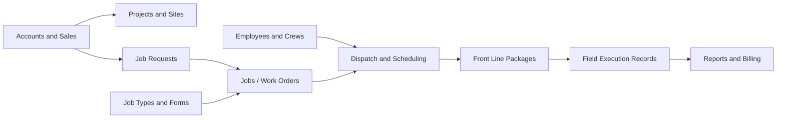

# BioRemedy Platform Database Handoff Map

**Status date:** August 1, 2026 (Front Line row updated August 16, 2026; `locations`
collection move updated August 17, 2026; `accounts`/`contacts` move and collection
counts updated September 15, 2026; Phase 01 completion and Phase 02 Places Model
rename -- `locations`->`facilities`, `mapLocations`->`locations`, new
`facilityContacts` -- updated September 16, 2026; Phase 03 account-domain work --
new `facilityComments` collection (site notes on the new Facility detail page,
mirrors `accountComments`), `accounts.ownerEmployeeId` now a real FK -- updated
September 16, 2026; Phase 04 vendor/subcontractor work -- new
`accountApprovedSubcontractors` collection (Layer 2: which vendors a specific
customer account has approved), `vendorProfiles.approvedById` now a real
employee FK -- updated September 17, 2026; Phase 05 contacts work -- fixed a
live data-loss bug where `contacts.notes` was shared between two unrelated
dialogs (general business notes vs. personal notes), split into `notes` /
`birthdayNote` / `personalNotes`; `contacts.accountId` is now optional
(account-less contacts, e.g. regulators/referrals, are now supported); fixed
an app-wide bug where every search-as-you-type input lost keyboard focus
after every keystroke -- updated September 17, 2026)

## Executive Summary

The project has a substantial PostgreSQL schema blueprint, but it does **not**
yet have a deployed production relational database.

| Layer | Current status |
|---|---|
| PostgreSQL design | 28 ordered SQL files defining **141 tables** and **27 views** |
| Laravel conversion | Only the first **12 tables** have Laravel migrations, models, and basic Filament resources |
| Running prototype server | Node server using `data/backend.json` with **76 collections** |
| Browser CRM storage | IndexedDB with **2 object stores** (`syncQueue`, `settings`) -- every core CRM collection moved to the shared JSON backend in Phase 01 (complete September 16, 2026); IndexedDB is now genuinely just the local cache/outbox |
| Uploaded files | Local filesystem under `data/uploads`; metadata is in the JSON backend |
| Front Line | Database and sync schema defined; no standalone iOS/Android app built. A rough in-browser phone-frame simulator now exists inside the CRM web app (`app.js`, `renderFrontline*` functions, reachable from the CRM home screen) — fake login (field-lead picker, no real auth), a 3x3 tile launcher, and a real Job Book/Work Plan flow that reads and writes the existing `dispatchJobs`/`jobSteps`/`jobActions`/`jobFormSubmissions` collections through the same `/api/backend` endpoints the desktop Dispatch Job Detail page uses. It validates the data model and UX end-to-end but is not the real mobile app. |

In other words, the architecture is much farther along than the production
database implementation. The next major technical task is to consolidate the
prototype stores into one PostgreSQL-backed API and apply the SQL definitions
as managed migrations.

## Business Flow

The intended central relationship is:

`Account -> Project -> Job Request -> Work Order -> Steps -> Actions -> Forms -> Typed Field Records -> Report/Billing`

Workforce, templates, equipment, and pricing feed the job without owning the
job itself.

## SQL Table Inventory

All tables below have SQL definitions in `crm-schema`. This means **schema
defined**, not necessarily deployed or connected to the running application.

### 1. Core CRM, Projects, and Operations - 15 tables

`accounts`, `contacts`, `facilities`, `facility_nodes`, `job_sites`,
`projects`, `work_orders`, `tasks`, `issues`, `crews`, `crew_members`,
`equipment`, `files`, `opportunities`, `activities`

Coverage: customers, contacts, physical customer hierarchy, project records,
basic jobs, tasks, issues, crews, equipment, files, sales opportunities, and
activity history.

### 2. Sales, Catalog, Documents, and Relationships - 28 tables

`dataverse_entity_map`, `dataverse_relationship_definitions`,
`crm_relationship_edges`, `transaction_currencies`, `business_units`,
`system_users`, `teams`, `unit_groups`, `units_of_measure`, `price_levels`,
`products`, `product_price_levels`, `leads`, `customer_addresses`,
`opportunity_products`, `quotes`, `quote_lines`, `sales_orders`,
`sales_order_lines`, `invoices`, `invoice_lines`, `competitors`,
`opportunity_competitors`, `activity_parties`, `annotations`,
`connection_roles`, `connections`, `opportunity_contacts`

Coverage: Dataverse-style ownership and relationships, product and price
catalog, leads, quotes, orders, invoices, competitors, notes, and sales
participants.

### 3. Project History, Sampling, and Spatial Data - 4 tables

`project_events`, `sampling_sessions`, `project_samples`,
`project_spatial_files`

Coverage: project chronology, field sampling, collector and custody details,
lab-result payloads, coordinates, photos, LiDAR, maps, drone files, and surveys.

### 4. Employees, Credentials, and Qualifications - 11 tables

`employees`, `employment_assignments`, `credential_types`,
`employee_credentials`, `certification_types`, `employee_certifications`,
`skills`, `employee_skills`, `equipment_qualification_types`,
`employee_equipment_qualifications`, `employee_documents`

Coverage: schedulable workers, employment history, credentials,
certifications, skills, equipment qualifications, expirations, verification,
and supporting documents.

### 5. Teams, Crews, Availability, and Scheduling - 9 tables

`team_memberships`, `work_calendars`, `shift_templates`,
`employee_calendar_assignments`, `employee_shift_assignments`,
`availability_blocks`, `time_off_requests`, `on_call_rotations`,
`on_call_rotation_members`

Coverage: organizational teams, dispatchable crews, calendars, shifts,
availability, leave, and on-call rosters. These extend the existing `teams`,
`crews`, and `crew_members` tables.

### 6. Form Template Engine - 8 tables

`form_templates`, `form_versions`, `form_sections`, `form_fields`,
`form_field_options`, `form_field_rules`, `form_output_mappings`,
`form_version_publication_checks`

Coverage: versioned forms, sections, typed fields, choices, conditional rules,
validation, calculations, publishing, and mappings from answers to operational
records.

### 7. Job Type Template Engine - 11 tables

`job_types`, `job_type_versions`, `job_step_definitions`,
`job_action_definitions`, `job_action_definition_dependencies`,
`job_action_form_links`, `job_type_required_certifications`,
`job_type_required_credentials`, `job_type_required_skills`,
`job_type_required_resources`, `job_type_publication_checks`

Coverage: versioned job types, ordered steps, executable actions, action
dependencies, required forms, workforce eligibility, resource requirements,
and publish checks.

### 8. Job Intake and Dispatch - 12 tables

`job_requests`, `job_request_documents`, `job_status_definitions`,
`job_status_transition_rules`, `job_contacts`, `job_locations`,
`job_schedule_segments`, `job_assignments`, `job_resource_allocations`,
`job_schedule_conflicts`, `dispatch_events`, `job_documents`

Coverage: sales-to-dispatch requests, linked customer accounts, customer
packets and quotes, job status rules, contact/location snapshots, schedule
segments, technician and crew assignments, equipment/material/vendor
allocations, conflict detection, dispatch audit events, and job documents.
The existing `work_orders` table is expanded into the first-class job record.

### 9. Field Execution - 18 tables

`job_step_instances`, `job_action_instances`,
`job_action_instance_dependencies`, `form_submissions`,
`form_submission_values`, `form_output_executions`, `job_execution_events`,
`job_time_entries`, `job_mileage_entries`, `job_material_usage`,
`job_equipment_usage`, `job_media`, `job_signatures`, `job_exceptions`,
`job_waste_containers`, `job_waste_shipments`,
`job_waste_shipment_containers`, `job_receipts`

Coverage: frozen job steps/actions, form responses, offline-safe output
processing, event history, labor time, mileage, materials, equipment, media,
signatures, field exceptions, waste tracking, manifests, and receipts.

### 10. Front Line Devices and Offline Sync - 11 tables

`frontline_devices`, `frontline_device_assignments`,
`frontline_device_sessions`, `frontline_job_packages`,
`frontline_job_package_recipients`, `frontline_commands`,
`frontline_attachment_uploads`, `frontline_sync_changes`,
`frontline_sync_cursors`, `frontline_sync_conflicts`,
`frontline_push_subscriptions`

Coverage: registered devices, worker/device ownership, scoped offline job
packages, command queues, resumable uploads, incremental sync, conflicts, and
push notifications. These tables are designed, but the Front Line application
and its production API endpoints still need to be built.

### 11. Reporting and Job Billing - 5 tables

`job_cost_entries`, `job_charge_entries`, `job_billing_reviews`,
`job_report_snapshots`, `job_report_section_snapshots`

Coverage: normalized job costs, billable charges, office billing review,
immutable report versions, and report sections used to generate field-service
PDFs.

### 12. Account, Vendor, and Sales Task Extensions - 9 tables

`account_types`, `industries`, `account_industries`, `addresses`,
`subcontractor_types`, `vendor_profiles`, `service_agreements`,
`subcontractor_assignments`, `sales_tasks`

Coverage: maintainable account type and industry picklists, account-scoped
addresses (freight, shipping, geocode), vendor/subcontractor onboarding and
compliance (insurance, W-9, safety), service agreements, job-specific
subcontractor assignments, and a dedicated Sales Task activity table. Adds
`account_types`, `tax_address_id`, `is_client`, `is_prospect`, `is_vendor`,
`is_subcontractor`, `eligible_for_subcontracting`, `relationship_status`,
`primary_relationship`, and `customer_status` to `accounts`. Also introduces
the `Standard` / `Activity` table type classification on
`dataverse_entity_map`. See
`docs/dataverse-relationship-architecture.md` for the full breakdown and
which older fields these supersede.

## SQL Views - 27

The schema also defines these read models:

- CRM: `sales_account_view`, `account_billing_signal_view`,
  `sales_contact_view`, `contact_outreach_view`,
  `opportunity_forecast_view`, `opportunity_qualification_view`,
  `activity_timeline_view`
- Account/vendor extensions: `vendor_profile_detail_view`,
  `sales_task_timeline_view`
- Relationships and sales documents: `dataverse_relationship_matrix_view`,
  `customer_relationship_summary_view`, `sales_document_chain_view`
- Projects and samples: `operations_all_projects_view`,
  `project_chronology_view`, `project_sample_detail_view`
- Workforce and templates: `employee_credential_status_view`,
  `workforce_roster_view`, `published_form_catalog_view`,
  `published_job_type_catalog_view`
- Dispatch and execution: `dispatch_board_view`,
  `job_execution_progress_view`, `frontline_device_health_view`
- Job review, Front Line, reporting, and billing: `job_detail_view`,
  `job_dispatch_readiness_view`, `frontline_assignment_view`,
  `job_billing_summary_view`, `job_report_timeline_view`

## What the Running Prototype Stores Today

These are working prototype collections, not production SQL tables.

### Browser IndexedDB - 2 stores

`syncQueue`, `settings`

Roadmap Phase 01 ("One Shared Data Layer") is **complete as of September 16,
2026**. Every core CRM collection that used to live only in the browser --
`accounts`, `contacts`, `projects` (formerly `jobs`, the store that actually
held projects, not dispatch jobs -- see the glossary), `tasks`, `activities`,
`projectAssignments`, `projectAlerts`, `materialUsage`, `equipmentLogs`,
`scheduledWork`, `spatialData` -- now lives in the shared JSON backend,
gated by role. Only `syncQueue` (a device-scoped offline outbox) and
`settings` (device/user preference) remain local, which is correct by
definition for both. See `docs/roadmap/phase-01-shared-data-layer.md` for
the full migration history and the role-gating decisions made per collection.

The store declarations were removed from `openDatabase()`, but existing
browsers still physically contain the old stores and their rows -- the
database version did not change, so `onupgradeneeded` never re-runs. Those
rows are orphaned rather than deleted, and are no longer read. No recovery
pass was added; that was a deliberate decision, recorded in the phase
document, applied consistently across every collection Phase 01 touched. The
dead local `projects` store (a hardcoded 3-row seed list with zero writes
ever) was also removed -- its rows were converted into real `projects`
records with `status: "Complete"` rather than discarded, so the Account
page's "Previous Projects" panel keeps showing them.

`laborResources` and `crewMemberships` (both JSON backend, not IndexedDB --
see below) were fully deleted September 16, 2026 as part of the same Phase 01
session's "clean up retired data" item, closing out a gap that had sat open
since August 17, 2026.

`sampleRecords` was moved out of IndexedDB into the JSON backend on
August 16, 2026 so field-collected samples are visible to the office rather
than being trapped on the collecting device. `facilities` (Account Facilities,
called `locations` until Phase 02 renamed it September 16, 2026) followed the
same move on August 17, 2026, gaining a full structured address in the
process -- see the JSON Backend list below.
`opportunities` moved to the JSON backend earlier (August 10, 2026, alongside
the Opportunity page redesign) but its now-unused IndexedDB store
declaration was left in `openDatabase`'s schema -- harmless (the store is
created but never written to), just not yet cleaned up in code.

`laborResources` (JSON backend, Inventory -> Labor view) was retired in code
on August 17, 2026, not migrated -- it duplicated real people from `employees`
under separate, unlinked IDs with independently-drifting hours/capacity
numbers. The Inventory Labor view and the Schedule dialog's Labor picker now
both read from `employees` directly. This also fixed a real server-side gap:
`validateScheduleEvent`'s certification-gating check (`server.mjs`) was
reading `laborResources.certifications` -- it now reads `employees.skills`,
so the check still fires instead of silently no-op'ing once the collection
was emptied. The 5 orphaned rows this left sitting in `data/backend.json`
(already unreachable via the API -- no `collectionAccess`/`defaultBackend`
entry existed for them) were finally deleted September 16, 2026, closing the
gap. `crewMemberships` (Workforce, 4 frozen seed rows, confirmed zero
`app.js` readers -- crew membership derives live from `employees.crewId`)
was retired the same way, same day: removed from `server.mjs` entirely and
deleted from `data/backend.json`.

### Node JSON Backend - 85 collections

> The count was previously documented as 72, then 76, then 82, then 83, then 84.
> Recounted directly from both `data/backend.json`'s top-level keys and
> `server.mjs`'s `defaultBackend` object on September 16, 2026, after Phase 02
> (Places Model) added `facilityContacts` (the account-facility-vs-old-`locations`-collection
> rename below is a rename, not a count change): 83, then again the same day
> after Phase 03 (Account Domain) added `facilityComments` (site notes on the
> new Facility detail page, mirrors `accountComments`): 84, then again
> September 17, 2026 after Phase 04 (Vendor & Subcontractor) added
> `accountApprovedSubcontractors` (Layer 2: which vendors a specific customer
> account has approved): **85**. Recount from source when it matters, don't
> trust the running tally.

> **Phase 02 rename, September 16, 2026:** the old `locations` collection
> (Account Facilities) is now `facilities`, and the old `mapLocations`
> collection (GPS points) is now `locations` -- matching the Facility/Address/
> Location naming contract in `docs/roadmap/GLOSSARY.md`. Every `locationId`
> FK that pointed at the old `locations` (facility) collection --
> `opportunities`, `projects`, `projectAlerts`, `spatialData`, `sampleRecords`
> -- was renamed to `facilityId` in the same pass. `mapLocations`' own outbound
> `projectId` FK was untouched (it was already correctly named). New this
> phase: `facilityContacts` (junction: which contacts work at or manage which
> facility) and four new fields on the GPS `locations` collection
> (`locationType`, `linearReference`, `isTemporary`, `retainUntil`,
> `retentionReason`) for the retention-on-temporary-locations requirement.
> Facility `status` was also renamed `badge` per the owner's request (it was
> never a real lifecycle state -- seeded from the account's sales phase).

- CRM: `accounts`, `contacts`, `projects` (formerly the IndexedDB `jobs`
  store, renamed in the same move), `tasks`, `activities`, and
  `projectAssignments` -- all moved from IndexedDB (`accounts`/`contacts`
  September 15, 2026; the rest September 16, 2026; all roadmap Phase 01,
  now complete), all six gated by the `customerDirectory` role group, which
  spans every internal role but excludes Client Portal. Also `facilities`
  (Account Facilities, one address each -- moved from IndexedDB August 17,
  2026 under the name `locations`; renamed to `facilities` in Phase 02,
  September 16, 2026, distinct from the GPS `locations` collection below) and
  `facilityContacts` (new in Phase 02 -- works-at/manages junction between
  `contacts` and `facilities`), `opportunityAssignments` (planning/sales team
  assignments on an opportunity, gained `employeeId`/`contactId`/
  `vendorAccountId`/`vendorContactId` fields August 17, 2026)
- Operations/inventory: `scheduleEvents`, `locations` (GPS points -- named
  `mapLocations` until Phase 02, September 16, 2026), `inventoryItems`,
  `purchaseOrders`, `equipmentAssets`, `laborAssignments`, `projectAlerts`,
  `materialUsage`, `equipmentLogs`, `scheduledWork`, `spatialData`
  (the last five moved from IndexedDB September 16, 2026, roadmap Phase 01;
  `projectAlerts` gated `operations` OR `sales` and `materialUsage` gated
  `operations` OR `finance`, both per an explicit owner decision to give
  Sales/Finance visibility into field alerts and job-cost data respectively;
  `equipmentLogs`/`scheduledWork`/`spatialData` gated `operations` only).
  (`timeEntries` retired September 16, 2026 -- zero `app.js` readers/writers
  beyond the blanket role-filter pass-through; its one seed row held a
  `jobId` referencing a project, the exact naming collision the Phase 01
  `jobs`->`projects` rename exists to clean up, so it wasn't worth renaming a
  field nobody read)
- Workforce: `employees`, `employeeCertifications`, `workforceTeams`,
  `workforceTeamMemberships`, `crewProfiles`,
  `availabilityBlocks`, `frontlineDevices`
- Jobs/dispatch: `jobRequests`, `jobRequestDocuments`, `dispatchJobs`,
  `jobAssignments`, `jobScheduleSegments`, `jobResources`, `jobConflicts`,
  `jobSteps`, `jobActions`, `jobFormSubmissions`, `jobTypeTemplates`,
  `jobStatusEvents`, `jobTaskAttachments`
- Field sampling: `sampleRecords`
- Sales/reference: `businessUnits`, `systemUsers`, `teams`,
  `transactionCurrencies`, `unitGroups`, `unitsOfMeasure`, `priceLevels`,
  `products`, `productPriceLevels`, `leads`, `opportunityContacts`,
  `opportunityProducts`, `quotes`, `quoteLines`, `salesOrders`,
  `salesOrderLines`, `competitors`, `opportunityCompetitors`, `annotations`,
  `connectionRoles`, `connections`, `activityParties`,
  `contactEmploymentHistory`
- Finance: `invoices`, `invoiceLines`, `qboSettings`, `qboExports`

The same concepts currently use different names in IndexedDB, JSON, and SQL.
That duplication must be removed during the production database migration.

### Recent prototype-only additions (Contact detail page redesign)

The Contact detail page was rebuilt into the same header + tabs pattern as
the Account detail page (Summary, Details, Communications, Opportunities,
Projects, Relationships, Files), with scoped edit dialogs per panel instead
of one large form. That work added a few fields/collections that exist only
in the browser prototype and JSON backend, with no SQL counterpart yet:

- `contacts.birthday` -- new scalar field, no `contacts` (`002_contacts.sql`)
  column.
- `contactEmploymentHistory` -- new collection (contact-scoped, repeatable:
  employer, title, start/end date, current flag). No SQL table.
- `opportunities.status` (`"Open" | "Won" | "Lost"`) -- opportunities
  previously only had a derived Won/Open status with no real "Lost" concept
  anywhere in the app. A `status` field was added so a deal can be marked
  Lost independent of `stage`; `stage === "Won"` still always wins. No
  `opportunities` (`013_opportunities.sql`) column for this yet.

See `docs/dataverse-relationship-architecture.md` for the note on the
Meeting/Call/Email/Task/Note activity dialogs also added in this pass, and
how they relate to the `activities` vs. `sales_tasks` direction described
there.

## What Still Needs Tables or a Stronger Model

### Priority 0 - Required Before Production

1. **Production identity and authorization:** role definitions, user-role
   assignments, permissions, role-permission mappings, service/API clients,
   and revocation. `system_users` exists, but the current role header is only a
   prototype.
2. **Audit and integration control:** immutable audit log, integration outbox,
   webhook deliveries, import/export jobs, failed-job handling, and
   system-wide idempotency records.
3. **Production document storage:** file versions, hashes, retention,
   visibility/access rules, and generic entity-to-file links. The existing
   `files` table and local upload folder are not sufficient for production.
4. **Managed migration baseline:** a real PostgreSQL database, migration
   history, seed/reference data, backups, restore testing, and conversion of
   migrations `013` through `025` into the selected application framework.

### Priority 1 - Major ERP Gaps

1. **Inventory and purchasing:** inventory locations, stock balances, stock
   movements, lots/batches, reorder rules, vendors, purchase orders, purchase
   order lines, receiving, and returns. The demo has JSON inventory and
   purchase orders, but the SQL schema does not yet have this ledger.
2. **Customer contracts and rate agreements:** customer packets at the account
   level, packet requirements, MSAs/contracts, scopes of work, insurance
   documents, rate sheets, labor/equipment/material rate lines, and change
   orders. Quotes and generic price lists exist, but BioRemedy-specific
   contracted rates are not fully modeled.
3. **Fleet and equipment maintenance:** vehicles, meter readings, inspections,
   preventive-maintenance plans, maintenance work orders, service history,
   downtime, and repair costs. The current `equipment` table is only a basic
   asset record.
4. **Vendor and subcontractor management:** now modeled in
   `027_vendor_subcontractor_management.sql` -- `vendor_profiles` (1:1
   account extension carrying onboarding/insurance/W-9/safety compliance),
   `subcontractor_types`, `service_agreements`, and
   `subcontractor_assignments` for job-specific commitments. Phase 04
   (2026-09-17) built the prototype equivalents of the first three (plus a
   new Layer 2, `accountApprovedSubcontractors` / customer-specific
   subcontractor approval, which has no SQL counterpart yet either -- add it
   to `027` when this schema is next touched) and gave them a real "Vendor &
   Subcontractor" tab on the account page. **Still open:** job/dispatch
   tables (`022_jobs_dispatch_assignments.sql`) do not link to this layer
   yet -- `job_resource_allocations.vendor_account_id` still points straight
   at `accounts`. **Correction, verified 2026-09-17:** this isn't just a
   SQL-schema gap -- the running JSON prototype's own dispatch-resource
   collection (`jobResources`) has no vendor/account FK at all today; its
   "Vendor" resource type is a bare free-text field. Closing this is a
   from-scratch build in both layers, not a repoint in either. When dispatch
   work resumes, point job-level vendor relationships at
   `subcontractor_assignments` instead, so job-specific terms don't get
   mixed into the vendor's general standing record. See the planning note in
   `docs/erp-operational-architecture.md` and in
   `docs/dataverse-relationship-architecture.md`.
5. **Accounting completion and QuickBooks integration:** payments, payment
   allocations, credit memos, vendor bills, expenses, tax mappings,
   accounting connections, export batches, sync results, and reconciliation.
   Invoices and a prototype QBO export queue exist.

### Priority 2 - Important Operational Depth

1. **Laboratory data normalization:** laboratories, analytical methods,
   analytes, test requests, custody transfers, result rows, qualifiers, and
   detection limits. Samples exist, but detailed lab results are currently
   stored mostly as JSON.
2. **Safety and compliance:** job hazard analyses, safety meetings, incidents,
   observations, permits, SDS records, corrective actions, and regulatory
   deadlines.
3. **Approvals and notifications:** approval requests, ordered approval steps,
   notifications, delivery attempts, subscriptions, escalations, and read
   state.
4. **Project commercial controls:** project budgets, committed costs,
   forecasts, change orders, and not-to-exceed revisions tied to approvals.

## Deliberately Out of Scope

Payroll, compensation, benefits, Social Security numbers, detailed medical
records, and payment-card data should remain in restricted external systems
unless BioRemedy deliberately creates separate security-bounded modules for
them.

## Recommended Next Build Order

1. Select the production stack and stand up PostgreSQL.
2. Reconcile IndexedDB and JSON names to the SQL model; make SQL the only
   authoritative business store.
3. Implement identity/RBAC, audit, durable file storage, and managed
   migrations.
4. Add inventory/purchasing, rate agreements/contracts, and accounting-sync
   tables.
5. Build APIs for workforce, templates, dispatch, execution, and reporting.
6. Build the standalone Front Line application against those APIs and the
   existing Front Line schema.

## Source Files

- SQL definitions: `crm-schema/001_accounts.sql` through
  `crm-schema/028_sales_task_activity.sql`
- Operational dictionary: `docs/erp-operational-architecture.md`
- Dataverse relationship design: `docs/dataverse-relationship-architecture.md`
- Prototype server collections: `server.mjs` and `data/backend.json`
- Browser database: `app.js`
- Partial Laravel conversion: `laravel-ready/`
