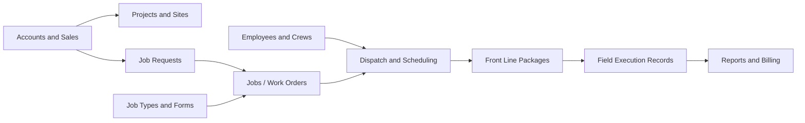

# BioRemedy Platform Database Handoff Map

**Status date:** August 1, 2026 (Front Line row updated August 16, 2026; `locations`
collection move updated August 17, 2026; `accounts`/`contacts` move and collection
counts updated September 15, 2026; Phase 01 completion and Phase 02 Places Model
rename -- `locations`->`facilities`, `mapLocations`->`locations`, new
`facilityContacts` -- updated September 16, 2026; Phase 03 account-domain work --
new `facilityComments` collection (site notes on the new Facility detail page,
mirrors `accountComments`), `accounts.ownerEmployeeId` now a real FK -- updated
September 16, 2026; Phase 04 vendor/subcontractor work -- new
`accountApprovedSubcontractors` collection (Layer 2: which vendors a specific
customer account has approved), `vendorProfiles.approvedById` now a real
employee FK -- updated September 17, 2026; Phase 05 contacts work -- fixed a
live data-loss bug where `contacts.notes` was shared between two unrelated
dialogs (general business notes vs. personal notes), split into `notes` /
`birthdayNote` / `personalNotes`; `contacts.accountId` is now optional
(account-less contacts, e.g. regulators/referrals, are now supported); fixed
an app-wide bug where every search-as-you-type input lost keyboard focus
after every keystroke; Phase 09 billing/invoicing work -- new `projects.closedAt` /
`projects.closeReport` fields (a stored, regenerable cost-report/P&L snapshot), no new top-level
collections -- updated September 17, 2026; Phase 10 Part 1 Front Line tiles (Time Sheet, Trips,
Settings) -- `timeEntries` reintroduced with a real Time Sheet tile behind it, new
`jobMileageEntries` collection behind a real Trips tile, Settings tile reads real session/employee/
device/connection state plus a new persisted `frontlineNotificationPrefs` browser setting -- updated
September 17, 2026; Phase 10 Part 2 Front Line tiles (Forms, Messaging, Location, Invoices) and the
concrete-gaps backlog -- new `messages` collection (threaded field-worker/dispatch messaging), new
`inventoryAlerts` collection (ops-manager flag when a Material task submission is forced past zero
on-hand), Forms tile reuses `jobFormSubmissions` with a new `standalone`/`submittedByEmployeeId`
shape, Location tile reuses `locations` with a new `reportedByEmployeeId` field, Invoices tile is
read-only against existing Phase 09 finance data, new `"Odometer"` job-action type writing to
`jobMileageEntries`, new ad hoc "+ Activity" job-action/jobFormSubmissions path (`adHoc: true`) for
untemplated notes/samples/signatures/photos/odometer legs, Sample task gained three required photo
fields (north view / interval / container label) and Material task gained free-text write-in items
(`jobResources.writeIn`) -- updated September 17, 2026; Phase 09 live bug follow-up -- 
`buildProjectCostReport()` now also aggregates dispatch-side `jobResources` (equipment
assignments and Consumed materials, keyed by `dispatchJobs.id`) across every dispatch job tied to
a project, not just the office-side `materialUsage`/`equipmentLogs` tables keyed directly by
`projects.id` -- a project with real field-assigned/consumed resources but no manual office log
entries was producing an all-zero cost report. `closeReport.costs.materials.items[]` and
`.equipment.items[]` gained a `source: "office-log"|"field-dispatch"` field to distinguish the two
origins; no new top-level collection -- updated September 18, 2026)

## Executive Summary

The project has a substantial PostgreSQL schema blueprint, but it does **not**
yet have a deployed production relational database.

| Layer | Current status |
|---|---|
| PostgreSQL design | 28 ordered SQL files defining **141 tables** and **27 views** |
| Laravel conversion | Only the first **12 tables** have Laravel migrations, models, and basic Filament resources |
| Running prototype server | Node server using `data/backend.json` with **97 collections** (recounted directly from `server.mjs`'s `collectionAccess` map, September 23, 2026: 96 after Phase 08 round two added `pricingSettings`, then 97 with Phase 10's `jobExpenses`; the September 17 count of 88 and this section's "86" header had both drifted) |
| Browser CRM storage | IndexedDB with **2 object stores** (`syncQueue`, `settings`) -- every core CRM collection moved to the shared JSON backend in Phase 01 (complete September 16, 2026); IndexedDB is now genuinely just the local cache/outbox |
| Uploaded files | Local filesystem under `data/uploads`; metadata is in the JSON backend |
| Front Line | Database and sync schema defined; no standalone iOS/Android app built (that decision is explicitly deferred -- see `docs/roadmap/phase-10-frontline.md`). A web-hosted phone-frame simulator exists inside the CRM web app (`app.js`, `renderFrontline*` functions, reachable from the CRM home screen) — fake login (field-lead picker, no real auth), a 3x3 tile launcher, and **eight real tiles** (all of Phase 10) that read/write the shared JSON backend through the same `/api/backend` endpoints the desktop uses: Job Book (work plan / typed task capture against `dispatchJobs`/`jobSteps`/`jobActions`/`jobFormSubmissions`, including a repeatable "+ Activity" ad hoc path and an `"Odometer"` task type), Time Sheet (clock-in/out against `timeEntries`), Trips (mileage against `jobMileageEntries`), Settings (real session/employee/device/connection state plus a persisted notification-preferences setting), Forms (a small standalone form catalog against `jobFormSubmissions`), Messaging (new `messages` collection, threaded by job or general), Location (the `locations` GPS collection plus a Leaflet satellite map, reused from the Facility detail page), and Invoices (read-only, reusing Phase 09's finance rows). It validates the data model and UX end-to-end but is not the real mobile app. |

In other words, the architecture is much farther along than the production
database implementation. The next major technical task is to consolidate the
prototype stores into one PostgreSQL-backed API and apply the SQL definitions
as managed migrations.

## Business Flow

```mermaid
flowchart LR
    CRM["Accounts and Sales"] --> Project["Projects and Sites"]
    CRM --> Intake["Job Requests"]
    Intake --> Job["Jobs / Work Orders"]
    Workforce["Employees and Crews"] --> Dispatch["Dispatch and Scheduling"]
    Templates["Job Types and Forms"] --> Job
    Job --> Dispatch
    Dispatch --> FrontLine["Front Line Packages"]
    FrontLine --> Execution["Field Execution Records"]
    Execution --> Reports["Reports and Billing"]
```

The intended central relationship is:

`Account -> Project -> Job Request -> Work Order -> Steps -> Actions -> Forms -> Typed Field Records -> Report/Billing`

Workforce, templates, equipment, and pricing feed the job without owning the
job itself.

## SQL Table Inventory

All tables below have SQL definitions in `crm-schema`. This means **schema
defined**, not necessarily deployed or connected to the running application.

### 1. Core CRM, Projects, and Operations - 15 tables

`accounts`, `contacts`, `facilities`, `facility_nodes`, `job_sites`,
`projects`, `work_orders`, `tasks`, `issues`, `crews`, `crew_members`,
`equipment`, `files`, `opportunities`, `activities`

Coverage: customers, contacts, physical customer hierarchy, project records,
basic jobs, tasks, issues, crews, equipment, files, sales opportunities, and
activity history.

### 2. Sales, Catalog, Documents, and Relationships - 28 tables

`dataverse_entity_map`, `dataverse_relationship_definitions`,
`crm_relationship_edges`, `transaction_currencies`, `business_units`,
`system_users`, `teams`, `unit_groups`, `units_of_measure`, `price_levels`,
`products`, `product_price_levels`, `leads`, `customer_addresses`,
`opportunity_products`, `quotes`, `quote_lines`, `sales_orders`,
`sales_order_lines`, `invoices`, `invoice_lines`, `competitors`,
`opportunity_competitors`, `activity_parties`, `annotations`,
`connection_roles`, `connections`, `opportunity_contacts`

Coverage: Dataverse-style ownership and relationships, product and price
catalog, leads, quotes, orders, invoices, competitors, notes, and sales
participants.

Note (Phase 08, 2026-09-17): the running JSON prototype now also has `estimates`/`estimateLines`,
structurally identical to `quotes`/`quoteLines` but a separate collection (owner decision: Quote
and Estimate are two distinct documents). This SQL schema predates that decision and has no
`estimates`/`estimate_lines` tables of its own -- whoever deploys this schema should either add
them (mirroring `quotes`/`quote_lines`) or fold Estimate in as a `quotes.document_type` flag,
whichever fits the eventual Postgres design better. Not resolved here since this schema is
designed-not-deployed reference per `CLAUDE.md`.

### 3. Project History, Sampling, and Spatial Data - 4 tables

`project_events`, `sampling_sessions`, `project_samples`,
`project_spatial_files`

Coverage: project chronology, field sampling, collector and custody details,
lab-result payloads, coordinates, photos, LiDAR, maps, drone files, and surveys.

### 4. Employees, Credentials, and Qualifications - 11 tables

`employees`, `employment_assignments`, `credential_types`,
`employee_credentials`, `certification_types`, `employee_certifications`,
`skills`, `employee_skills`, `equipment_qualification_types`,
`employee_equipment_qualifications`, `employee_documents`

Coverage: schedulable workers, employment history, credentials,
certifications, skills, equipment qualifications, expirations, verification,
and supporting documents.

### 5. Teams, Crews, Availability, and Scheduling - 9 tables

`team_memberships`, `work_calendars`, `shift_templates`,
`employee_calendar_assignments`, `employee_shift_assignments`,
`availability_blocks`, `time_off_requests`, `on_call_rotations`,
`on_call_rotation_members`

Coverage: organizational teams, dispatchable crews, calendars, shifts,
availability, leave, and on-call rosters. These extend the existing `teams`,
`crews`, and `crew_members` tables.

### 6. Form Template Engine - 8 tables

`form_templates`, `form_versions`, `form_sections`, `form_fields`,
`form_field_options`, `form_field_rules`, `form_output_mappings`,
`form_version_publication_checks`

Coverage: versioned forms, sections, typed fields, choices, conditional rules,
validation, calculations, publishing, and mappings from answers to operational
records.

### 7. Job Type Template Engine - 11 tables

`job_types`, `job_type_versions`, `job_step_definitions`,
`job_action_definitions`, `job_action_definition_dependencies`,
`job_action_form_links`, `job_type_required_certifications`,
`job_type_required_credentials`, `job_type_required_skills`,
`job_type_required_resources`, `job_type_publication_checks`

Coverage: versioned job types, ordered steps, executable actions, action
dependencies, required forms, workforce eligibility, resource requirements,
and publish checks.

### 8. Job Intake and Dispatch - 12 tables

`job_requests`, `job_request_documents`, `job_status_definitions`,
`job_status_transition_rules`, `job_contacts`, `job_locations`,
`job_schedule_segments`, `job_assignments`, `job_resource_allocations`,
`job_schedule_conflicts`, `dispatch_events`, `job_documents`

Coverage: sales-to-dispatch requests, linked customer accounts, customer
packets and quotes, job status rules, contact/location snapshots, schedule
segments, technician and crew assignments, equipment/material/vendor
allocations, conflict detection, dispatch audit events, and job documents.
The existing `work_orders` table is expanded into the first-class job record.

### 9. Field Execution - 18 tables

`job_step_instances`, `job_action_instances`,
`job_action_instance_dependencies`, `form_submissions`,
`form_submission_values`, `form_output_executions`, `job_execution_events`,
`job_time_entries`, `job_mileage_entries`, `job_material_usage`,
`job_equipment_usage`, `job_media`, `job_signatures`, `job_exceptions`,
`job_waste_containers`, `job_waste_shipments`,
`job_waste_shipment_containers`, `job_receipts`

Coverage: frozen job steps/actions, form responses, offline-safe output
processing, event history, labor time, mileage, materials, equipment, media,
signatures, field exceptions, waste tracking, manifests, and receipts.

### 10. Front Line Devices and Offline Sync - 11 tables

`frontline_devices`, `frontline_device_assignments`,
`frontline_device_sessions`, `frontline_job_packages`,
`frontline_job_package_recipients`, `frontline_commands`,
`frontline_attachment_uploads`, `frontline_sync_changes`,
`frontline_sync_cursors`, `frontline_sync_conflicts`,
`frontline_push_subscriptions`

Coverage: registered devices, worker/device ownership, scoped offline job
packages, command queues, resumable uploads, incremental sync, conflicts, and
push notifications. These tables are designed, but the Front Line application
and its production API endpoints still need to be built.

### 11. Reporting and Job Billing - 5 tables

`job_cost_entries`, `job_charge_entries`, `job_billing_reviews`,
`job_report_snapshots`, `job_report_section_snapshots`

Coverage: normalized job costs, billable charges, office billing review,
immutable report versions, and report sections used to generate field-service
PDFs.

### 12. Account, Vendor, and Sales Task Extensions - 9 tables

`account_types`, `industries`, `account_industries`, `addresses`,
`subcontractor_types`, `vendor_profiles`, `service_agreements`,
`subcontractor_assignments`, `sales_tasks`

Coverage: maintainable account type and industry picklists, account-scoped
addresses (freight, shipping, geocode), vendor/subcontractor onboarding and
compliance (insurance, W-9, safety), service agreements, job-specific
subcontractor assignments, and a dedicated Sales Task activity table. Adds
`account_types`, `tax_address_id`, `is_client`, `is_prospect`, `is_vendor`,
`is_subcontractor`, `eligible_for_subcontracting`, `relationship_status`,
`primary_relationship`, and `customer_status` to `accounts`. Also introduces
the `Standard` / `Activity` table type classification on
`dataverse_entity_map`. See
`docs/dataverse-relationship-architecture.md` for the full breakdown and
which older fields these supersede.

## SQL Views - 27

The schema also defines these read models:

- CRM: `sales_account_view`, `account_billing_signal_view`,
  `sales_contact_view`, `contact_outreach_view`,
  `opportunity_forecast_view`, `opportunity_qualification_view`,
  `activity_timeline_view`
- Account/vendor extensions: `vendor_profile_detail_view`,
  `sales_task_timeline_view`
- Relationships and sales documents: `dataverse_relationship_matrix_view`,
  `customer_relationship_summary_view`, `sales_document_chain_view`
- Projects and samples: `operations_all_projects_view`,
  `project_chronology_view`, `project_sample_detail_view`
- Workforce and templates: `employee_credential_status_view`,
  `workforce_roster_view`, `published_form_catalog_view`,
  `published_job_type_catalog_view`
- Dispatch and execution: `dispatch_board_view`,
  `job_execution_progress_view`, `frontline_device_health_view`
- Job review, Front Line, reporting, and billing: `job_detail_view`,
  `job_dispatch_readiness_view`, `frontline_assignment_view`,
  `job_billing_summary_view`, `job_report_timeline_view`

## What the Running Prototype Stores Today

These are working prototype collections, not production SQL tables.

### Browser IndexedDB - 2 stores

`syncQueue`, `settings`

Roadmap Phase 01 ("One Shared Data Layer") is **complete as of September 16,
2026**. Every core CRM collection that used to live only in the browser --
`accounts`, `contacts`, `projects` (formerly `jobs`, the store that actually
held projects, not dispatch jobs -- see the glossary), `tasks`, `activities`,
`projectAssignments`, `projectAlerts`, `materialUsage`, `equipmentLogs`,
`scheduledWork`, `spatialData` -- now lives in the shared JSON backend,
gated by role. Only `syncQueue` (a device-scoped offline outbox) and
`settings` (device/user preference) remain local, which is correct by
definition for both. See `docs/roadmap/phase-01-shared-data-layer.md` for
the full migration history and the role-gating decisions made per collection.

The store declarations were removed from `openDatabase()`, but existing
browsers still physically contain the old stores and their rows -- the
database version did not change, so `onupgradeneeded` never re-runs. Those
rows are orphaned rather than deleted, and are no longer read. No recovery
pass was added; that was a deliberate decision, recorded in the phase
document, applied consistently across every collection Phase 01 touched. The
dead local `projects` store (a hardcoded 3-row seed list with zero writes
ever) was also removed -- its rows were converted into real `projects`
records with `status: "Complete"` rather than discarded, so the Account
page's "Previous Projects" panel keeps showing them.

`laborResources` and `crewMemberships` (both JSON backend, not IndexedDB --
see below) were fully deleted September 16, 2026 as part of the same Phase 01
session's "clean up retired data" item, closing out a gap that had sat open
since August 17, 2026.

`sampleRecords` was moved out of IndexedDB into the JSON backend on
August 16, 2026 so field-collected samples are visible to the office rather
than being trapped on the collecting device. `facilities` (Account Facilities,
called `locations` until Phase 02 renamed it September 16, 2026) followed the
same move on August 17, 2026, gaining a full structured address in the
process -- see the JSON Backend list below.
`opportunities` moved to the JSON backend earlier (August 10, 2026, alongside
the Opportunity page redesign) but its now-unused IndexedDB store
declaration was left in `openDatabase`'s schema -- harmless (the store is
created but never written to), just not yet cleaned up in code.

**Phase 09 (2026-09-17)** added a real "close project" transition and a stored cost-report/P&L
snapshot, both on the existing `projects` collection -- no new top-level collections. New fields:
`projects.closedAt` (ISO timestamp, set once when a project is explicitly closed; `null`/absent
means not closed) and `projects.closeReport` (an object snapshot, not a live-computed view --
`{ priceLevelId, costs: { materials: { unitCost, rateSource, items[], total }, equipment: {...},
labor: { unitCost, rateSource, hours, entries[], total }, total }, revenue: { quoted, quotedSource,
invoiced }, margin, marginPercent, generatedAt, regeneratedAt } }`). Owner decisions (2026-09-17):
(1) closing a project does **not** lock out further equipment/labor/material usage entries --
costs can post after close, and a "Regenerate" button on the project's new Billing & cost report
panel re-runs the same generation logic and overwrites `closeReport` in place (keeping the original
`generatedAt` but stamping a new `regeneratedAt`); (2) the report is a stored snapshot generated at
close/regenerate time, never recomputed on page view; no history array is kept -- only the latest
snapshot persists, an explicit simplicity-over-audit-trail choice documented in
`phase-09-billing-invoicing.md` (Phase 12's real audit log is the better place for point-in-time
history once it exists); (3) waste-disposal cost (Phase 11/Field Ops Depth) does **not** feed this
P&L -- explicitly deferred, not forgotten. The close action is gated on `projects.projectStage`
having reached "Closeout" on the existing `PROJECT_STAGES` ladder (Phase 07 item 11's fix is what
makes that field trustworthy). Real per-project labor hours turned out not to exist anywhere (Phase
07 item 12 only fixed a cross-project cumulative `employees.hoursWorked`, not a per-job figure) --
the cost report instead sums Front Line Timer-task `jobFormSubmissions.payload.hours` across every
`dispatchJobs` row linked to the project, the one place the app captures hours tied to a specific
job. A second gap: Phase 08's rate card (`products`/`priceLevels`/`productPriceLevels`) was priced
entirely as whole-engagement day-rate services, with nothing granular enough to cost a single
equipment-log or unit of material. Rather than fabricate false per-asset/per-employee-role
granularity, this phase added three generic cost-basis products to the rate card seed data --
`prod-field-labor-standard` ($95/hr), `prod-equipment-standard-daily` ($650/day),
`prod-material-standard-unit` ($42/unit) -- plus a new `unit-group-consumables`/`uom-unit` pair so
material usage (which has no UoM FK, just a free-text `unit` string) has a genuine per-unit rate
to resolve. `getFinanceRows()`/`openInvoiceDialog()` were updated to prefer a project's
`closeReport` numbers over the old flat per-item cost heuristics once one exists, which is how the
generated report "feeds" the existing invoice dialog without a parallel invoice path. See
`docs/roadmap/phase-09-billing-invoicing.md` for the full writeup.

**Phase 06's 2026-09-22 pass, completed 2026-09-23 (two sessions)** — one new collection, one field
replaced, one field's write-through fallback removed (plus two others), several fields relocated
(no schema change for the relocations). **New collection:** `opportunityLocations` (`id`,
`opportunityId`, `type` "Facility"/"Location", `facilityId` or `locationId`, `role`, `note`,
soft-deletable via `deletedAt`) — the opportunity↔facility/location junction items 30/31 needed,
same shape as `opportunityContacts`. Registered in `server.mjs`'s `collectionAccess`/
`defaultBackend`/role-gated response filter (a new top-level collection is a three-place server
change, not just a JSON-file addition). **Field replacement:** `opportunities.closeQuarter` (a
`"YYYY-Q#"` string) is gone, replaced outright by `opportunities.closeBand` (one of
`"0-30"`/`"31-60"`/`"61-90"`/`"91-360"`/`"beyond-360"`, or blank for no target) and
`opportunities.closeBandSetAt` (ISO timestamp, advances only when the band value itself changes).
**Data migration executed:** all 13 real opportunities in `data/backend.json` had `closeQuarter`
converted to a `closeBand`/`closeBandSetAt` pair (bucketed by days-to-quarter-end relative to the
2026-09-23 migration date) and the `closeQuarter` field deleted outright — not kept alongside, per
this project's own "two parallel vocabularies" lesson from the `closeDate`/`estimatedCloseDate`
history. The 4 representative seed opportunities in `server.mjs` were migrated the same way.
**Write-through fallbacks removed** from `buildCoreOpportunityRecord()` for `proposedSolution`,
`customerNeed`, and `description` (item 29) — they used to silently copy `nextStep`/`serviceType` in
on first save if blank. **Data cleanup:** 12 `opportunities` rows had `proposedSolution` blanked
(character-identical to `nextStep`, confirming contamination) per the locked Q11 decision — if a
query ever needs "why is this opportunity's proposed solution blank," this is why.
`customerNeed`/`description` have the same contamination pattern in ~10 rows each but were **not**
blanked (no locked decision covers them yet). **Relocated, no schema change:**
`opportunities.customerNeed` is now edited from the Lead & Qualification dialog/panel instead of the
Develop dialog/panel (item 35 sub-piece 1) — same field, different edit surface.

**Phase 17 (2026-09-23)** is rendering-only — no new collections or persisted fields. Six new tables
(All Projects, Scheduled Work, Multi-Stage Remediation, Consumables, Equipment, plus the existing
Purchase Orders table already on this pattern) now share one `renderDataTable()`/`getTableState()`
component instead of bespoke search boxes; table search/sort state lives in `state.tables`
(client-only, never persisted). The operations calendar became a real month grid
(`buildCalendarMonthDays()`) instead of a 7-day flat strip. The operations map gained a filter panel
(`state.opsMapFilters`, client-only) — `getMapMarkers()` marker objects gained `projectId`/
`accountId`/`projectStage` fields for filtering purposes, but these are derived at read time from
the existing `locations`/`projects` records, not new persisted fields on `locations` itself.

**Phase 08's 2026-09-22 pass, items 6/7 (2026-09-23)** — one new field: `quotes.sourceEstimateId`,
set when a quote is created via "Convert to quote" on an estimate (blank otherwise). Converting the
same estimate twice is allowed and creates two independent quote rows, each with its own
`sourceEstimateId` pointing at the same estimate — there is no dedup and no back-reference on the
estimate side (an estimate does not know how many quotes were made from it; query
`quotes.filter(q => q.sourceEstimateId === estimateId)` if that's ever needed). `estimates.effectiveFrom`/
`effectiveTo` still exist as fields (not removed from the schema) but are no longer editable —
existing values are preserved on save, new estimates never get them. No new collections.

**Phase 18 (2026-09-23), items 1–3** — two new top-level JSON-backend collections plus new fields on
the existing `frontlineDevices`. `standbyAssignments` (`id`, `employeeId`, `startsAt`, `endsAt`,
`notes`, `createdBy`, `createdAt`, soft-deletable via `deletedAt`) models standby/on-call as a real
commitment, deliberately separate from `availabilityBlocks` (which already had an `"On call"` type
before this phase — see the phase doc's corrections for why that's the wrong model to have reused).
`standbyRotationSettings` is a one-row collection (`id: "default"`, `rotationPattern`, `notes`,
`updatedBy`, `updatedAt`) standing in for a real shared-settings surface, which doesn't exist yet.
`frontlineDevices` gained `hardwareModel`, `imei`, `osVersion`, `onboardedAt`, `ownership`
(`"Company"`/`"Personal"`), and `deletedAt` (soft delete); `registrationStatus` gained two new real
values, `"Suspended"` and `"Retired"`, both enforced at Front Line sign-in
(`frontlineLogin()` blocks an employee whose only registered device(s) are all suspended/retired).
**Both new collections required matching entries in `server.mjs`'s `collectionAccess`,
`defaultBackend`, and the role-gated response filter** — the server 404s any `saveBackendRecord()`
call to a collection name it doesn't already know about, so adding a new top-level collection is a
three-place server change, not just a frontend one. Item 4 (per-dispatch sign-on links + GPS
consent) is not started — see the phase doc.

**Phase 16 (2026-09-23)** added the emergency intake fields — all on the existing `projects`
collection, no new collection, written once at creation by `submitEmergencyIntake()` and otherwise
untouched by any other flow. New fields: `callerName`, `callerPhone`, `callerRelationship`,
`spillMaterial`, `spillQuantity`, `spillSurface`, `stormDrainInvolved`, `offRoadDischarge`,
`absorbentDeployed`, `absorbentDeployedBy`, `lawEnforcementStatus`, `fireDepartmentStatus`,
`otherEmergencyServicesStatus`, `agencyIncidentNumber`, `hasInsurance`, `isInsuranceClaim`,
`insuranceCarrier`, `insurancePolicyNumber`, `insuranceClaimNumber`, `policyCopyOnFile`,
`downPaymentAmount`, `downPaymentBy`, `downPaymentReference`, `mobilizationStatus`,
`mobilizationNote`, `mobilizationClearedAt`, `mobilizationOverrideBy`, `mobilizationOverrideReason`,
`incidentReportedAt`, `incidentLatitude`, `incidentLongitude`. `mobilizationStatus` is one of
`"Cleared to mobilize"`, `"Blocked — awaiting down payment"`, or `"Blocked — awaiting insurance
documentation"` — computed once at intake per the locked Q14/Q15 decision tree
(`computeEmergencyMobilization()`) and never recomputed automatically; a later status change (e.g.
a down payment arriving after the fact) would need its own explicit action, which doesn't exist yet.
Also new: `accounts.isProvisional` (boolean, set on an account created inline during emergency
intake — flagged for office cleanup per Q16, no cleanup workflow built yet) and a `locations` row
per intake with `locationType: "Spill origin"`, written only when a GPS pin was captured. No new
collections.

**Phase 15 (2026-09-23)** added the sales-to-operations handover to `projects` -- no new top-level
collections, six new fields on the existing `projects` record, all copied once at creation from the
won opportunity and never re-synced afterward (owner decision: "we just need the data, where it came
from doesn't matter" -- no provenance badging, no drift detection): `equipmentNeeds`, `vendorNeeds`,
`resourceNeeds` (arrays of `{ name, note }`, same shape as the opportunity fields they're copied
from), `siteWalkStatus` (previously hardcoded to `"Incomplete"` at creation regardless of the
opportunity's real status -- now actually carried over), and `quoteId`/`estimateId` (copied
references, not a line-item snapshot -- `quoteLinesForQuote()`/`estimateLinesForEstimate()` read the
referenced document live, so the project's "priced baseline" panel keeps showing the same document
even if the opportunity's own "current" quote changes later). Site photos were **not** carried over
-- the opportunity has no `sitePhotoRefs` field to carry from; blocked on Phase 13 per the phase doc.
Also added `closeProjectsForLostOpportunity()`: when an opportunity's `status` transitions to
`"Lost"`, every non-closed `projects` row with a matching `opportunityId` is closed with
`outcome: "Lost"` and `status: "Cancelled"` -- a separate path from Phase 09's `closeProject()` that
does **not** gate on reaching the "Closeout" stage (a lost deal never reaches it) and does **not**
generate a cost report (no billable outcome). Verified live 2026-09-23. The project detail page was
also restructured from one long scrolling page into three tabs (Intake/Plan/Live, same pattern and
`state.projectDetailTab` convention as Account/Contact/Opportunity) -- no schema change, UI only. The
"customer paperwork" flag on the Intake tab is **not** a carried-over opportunity field -- the
opportunity has no such field to carry, so it reads live from the project's own `jobRequests`
(`customerPacketStatus` / `documentRole: "customer_packet"` uploads) instead, same data the job
request dialog's "prior packet" logic already used. This is a placeholder per the phase doc's item 2;
Phase 13's document requirement/review model replaces it. See
`docs/roadmap/phase-15-project-execution-workspace.md`.

**Phase 08 (2026-09-17)** added two new JSON-backend collections, `estimates` and `estimateLines`,
structurally identical to the pre-existing `quotes`/`quoteLines` -- owner decision: Quote and
Estimate are two genuinely separate documents, not one type with a status flag (the source notes
used the words interchangeably, but the built system does not). Both new collections are gated
under the existing `salesDocuments` role group alongside `quotes`/`quoteLines`/`products`/
`priceLevels`/`unitsOfMeasure`. `opportunities.estimateId` was added alongside the pre-existing
`opportunities.quoteId`, both pointing at whichever quote/estimate is "current" for that
opportunity. No new fields were added to `products`, `priceLevels`, `unitsOfMeasure`, `unitGroups`,
or `productPriceLevels` -- this phase built the missing *UI* (a line-item builder for quotes/
estimates, and a Rate Card admin screen for products/units/price levels), not new schema, since the
collections already existed with the right shape but zero reads/writes (see
`phase-08-quotes-estimates.md`'s "Where this actually stands today" section). A real bug was found
and fixed in the process: `opportunities.quoteId`/`estimateId` were previously only set when
*creating* a brand-new quote/estimate, never when editing an existing one that had never been
explicitly marked current -- both pre-existing seeded quotes were affected (attached via
`quotes.opportunityId` but never marked "current" on their opportunity), which also silently
blocked the Negotiation stage gate's "Quote" requirement for those records. `projects` did **not**
gain its own `quoteId`/`estimateId` -- the opportunity->document link is transitively reachable via
`projects.opportunityId`, and a project's `budget` is set once at creation time as a value snapshot
from whichever document was current then, not a live pointer that would need its own FK. See
`docs/roadmap/phase-08-quotes-estimates.md` for the full writeup.

**Phase 08 live-bug-report follow-up (2026-09-17)** added fields to `quotes` and `estimates`
(same shape on both): `notes` (free text, internal/customer notes shown on the print view),
`billingAddressId` and `shippingAddressId` (FKs into the existing `addresses` collection, same
`populateAddressSelect()` pattern already used by service agreements/subcontractor assignments --
no new address types were invented). `quoteLines`/`estimateLines` gained `isOptional` (boolean) --
a write-in line the customer can accept or decline, excluded from `totalAmount` until picked, shown
separately on the print view under "Optional / write-in options." No new collections. Also fixed:
`opportunities.quoteId`/`estimateId` ("Current") could previously only be set automatically by
saving a quote/estimate (new record, or first one ever attached) -- there was no way to switch
"Current" back to an older document once a newer one existed. Added `markQuoteCurrent()`/
`markEstimateCurrent()` in `app.js` plus a "Mark current" button on any non-current quote/estimate
in the opportunity's Proposal & Documents tab. Also added print/export: `printOpportunityQuote()`/
`printOpportunityEstimate()` open a new browser tab with a print-formatted view (account, site,
billing/shipping address, required line items + total, optional/write-in lines, notes) and a
"Print / Save as PDF" button -- browser print-to-PDF, no new PDF library. See
`docs/roadmap/phase-08-quotes-estimates.md`'s "Live bug report follow-up" section for the full
writeup.

**Phase 08 round two: the rate-card rework (2026-09-23, sprint Wave 1)** modelled BioRemedy's real
`2026 RATES.xlsx`. One new collection and new fields on existing ones:

- **New collection `pricingSettings`** (gated `salesDocuments`; one row, `pricing-settings-default`):
  `fuelSurchargePercent` (null until the owner sets it), `fuelSurchargeUpdatedAt`,
  `fuelSurchargeNote` (e.g. which DOE fuel average), `energySecurityFeePercent` (default 18). New
  documents snapshot both percentages, and each document can override them.
- **`priceLevels` are now rate sheets:** `isDefault`, `sourceFile`, `sourceSheet`. The existing
  `price-standard-2026` row became "2026 Rate Sheet" (the workbook's "Rate Sheet" tab, the default)
  so existing references needed no migration. `price-sheet5-2026` is the workbook's second tab.
- **`productPriceLevels`** (product x rate sheet, still one row each) gained `amountOtEmergency` and
  `amountDoubleTime` beside the existing `amount` (= Standard). `null` means N/A on the sheet, which
  bills at Standard. Also gained `markupPercent` (with `pricingMethodCode: "PercentMarkupCurrentCost"`
  for cost-plus rows, where `amount` is null), `rateNote`, `sheetItemName` and `importSource`. SQL
  impact: three numeric columns and two text columns on `product_price_levels`. No new table.
- **`products`** gained `category` and `subcategory` (rate-sheet sections), `fuelSurchargeApplies`,
  `minimumQuantity` with `minimumAppliesWhen: "emergency"` (4 on every hourly item), and
  `importSource`.
- **`quotes` / `estimates`** gained `rateTier` (document default), `isEmergencyCallout`,
  `fuelSurchargePercent`, `energySecurityFeePercent`, `subtotalAmount`, `fuelSurchargeAmount` and
  `energySecurityFeeAmount`. `totalAmount` remains the grand total (items + surcharge + fee).
  Documents saved before the rework have no fee field and keep a 0% fee.
- **`quoteLines` / `estimateLines`** gained `lineKind` (`item` | `fuel_surcharge` |
  `energy_security_fee`; the last two are generated on save and never hand-edited), `sequenceNumber`,
  `rateTier`, `pricingMethod` (`rate` | `cost_plus`), `unitCost` and `markupPercent` (cost-plus
  lines; `pricePerUnit` holds the marked-up price), `minimumQuantity`, `billableQuantity` (what's
  billed: max(quantity, minimum) on an emergency call-out), `minimumApplied`, and
  `fuelSurchargeApplies`.
- **`equipmentAssets.productId` / `inventoryItems.productId`:** the rate-card line an asset or
  consumable bills as (many assets to one product). Both collections are whitelisted in
  `server.mjs` `normalizeRecord()`, and `productId` was added there.
- **Units of measure:** 17 new `unitsOfMeasure` rows (each, per man per day, per foot, per foot per
  day, per 100 ft per day, per test/suit/pair/bale/bag/section/gallon/pail/roll/load/sample/sq ft)
  in a new `unit-group-rate-sheet` group.
- **Import:** `scripts/import-rate-sheet.mjs` is re-runnable and upserts through the API with IDs
  derived from item names (`prod-rs-*`, `ppl-rs-*` / `ppl-s5-*`). A re-run updates prices in place
  and keeps admin edits to product flags.

**Sprint Wave 2 (2026-09-23):**
- **New collection `jobExpenses`** (Phase 10 receipts; gated `dispatch`, readable by operations and finance): `dispatchJobId`, `projectId`, `employeeId`, `incurredOn`, `amount`, `vendor`, `category`, `paymentMethod`, `reimbursable`, `billable`, `note`, `status`, `receiptAttachmentId`, `submittedAt`.
- The receipt file is a `jobTaskAttachments` row with `kind: "receipt"` and a new `expenseId` (`actionId` empty), uploaded via `POST /api/job-expenses/:id/receipt`.
- `projects.closeReport.costs` gained `expenses: { items, total }`.
- **`facilities`** gained `environmentalRisk` (Low / Medium / High, blank = not assessed) and `environmentalRiskNotes` (Phase 03 Q55). `accounts.risk` is now only a fallback for accounts whose sites are all unassessed.
- **`industries`** gained `naicsCode`. Three rows were added (`industry-environmental`, `industry-utilities-infrastructure`, `industry-education`) and `industry-municipal-government` was renamed "Municipal / Government / DOT", in both the `server.mjs` seed and the live data (upserted via the API).
- `accountIndustries` is the authoritative account industry; `accounts.industry` is dead (0 rows populated).
- `opportunities.industry` still stores an industry *name*, now picked from the curated list.
- No schema change for phone numbers: they're stored formatted (`555-123-4567`, `1-555-123-4567 x204`), and old rows are formatted at display time.

**Sprint Wave 3 (2026-09-23):**
- **`activities.relatedRecords`** ("Regarding", Phase 06 item 20): an array of `{ type, id }`, type ∈ `contact | facility | account | opportunity | dispatchJob | project`, normalised by `buildCoreActivityRecord()`. Every per-record activity query also returns activities that reference the record. SQL impact: this is the `activity_parties` shape (one row per activity × referenced record) already in `crm-schema/`, not a JSON column; map it there at cutover.
- No new collections.
- The Phase 04 approved-subcontractor picker now stores the same `subcontractorAccountId`, picked through a lookup instead of a `<select>`.

**Sprint Wave 4 (2026-09-23):**
- **`jobResources`** (type Vendor) gained `vendorAccountId`, `subcontractorAssignmentId` and `scopeNote` (Phase 04 item 5). At cutover, `job_resource_allocations` should gain `subcontractor_assignment_id` and keep `vendor_account_id` alongside it, since the approval check needs the vendor and a job-only vendor may have no standing assignment.
- **`subcontractorAssignments`** gained `pricingBasis` (`fixed` | `rate-sheet`; Phase 04 item 14). Only the matching fields are saved: `rateAmount`/`rateType` for fixed, `priceLevelId` for rate sheet.
- No new collections.

**Sprint Wave 5 (2026-09-23) — Phase 11 field ops depth.** Six new collections and new fields:
- **`weatherSnapshots`** (new; gated `operations`, readable by sales and finance). Fields:
  - `projectId`; `dispatchJobId` (empty for the incident snapshot); `kind` (`incident` | `response`).
  - `observedFor`: the moment looked up, either `projects.incidentReportedAt` or the job's first `in_progress` status event.
  - `latitude`/`longitude`; `anchorSource` (`GPS location` | `Dispatch job coordinates` | `Emergency intake pin`); `anchorLocationId`; `anchorLabel`.
  - `requestedBy`, `fetchedAt`, `status` (`captured` | `not_captured`), `error`.
  - Once captured: `provider`, `providerEndpoint`, `observationTime`, `conditions`, `weatherCode` (WMO), `temperatureF`, `relativeHumidity`, `precipitationIn`, `windSpeedMph`, `windGustMph`, `windDirectionDeg`, `windDirection`.

  Append-only: only `POST /api/weather-snapshots/capture` writes it (a generic POST returns 405). There is at most one captured row per project + kind (+ job), and failed attempts stay as history. SQL: new `weather_snapshots` table.
- **`permits`** (new; gated `operations`, readable by inventory and finance): `name`, `permitType`, `permitNumber`, `issuingAgency`, `issuedOn`, `expiresOn`, `renewalLeadDays` (default 60), `storageLimitDays`, `wasteTypesCovered`, `status`, `notes`, `updatedBy`. Seeded with the owner's two permits, numbers and dates blank. SQL: new `company_permits` table (the Priority 2 safety/compliance permit model).
- **`wasteRecords`** (new; gated `operations`, readable by finance). Fields:
  - `projectId`, `dispatchJobId`, `description`, `classification`, `wasteCode`.
  - `containerType`, `containerCount`, `quantity`, `unit`, `permitId` → permits, `storageLocation`, `accumulationStartedOn`.
  - `status` (`Accumulating` | `Disposal requested` | `Shipped` | `Disposed`), `disposalRequestedOn`, `disposalVendorAccountId` → accounts, `disposalFacility`, `manifestNumber`, `shippedOn`, `disposedOn`.
  - `disposalCost`, `notes`, `createdAt`, `createdBy`, `updatedBy`.

  `disposalCost` feeds `projects.closeReport.costs.waste`. SQL: new `waste_records` table; manifest files go to Phase 13's store.
- **`notifications`** (new; gated `customerDirectory`, i.e. every internal role): `dedupeKey`, `title`, `body`, `severity` (`info` | `warning` | `critical`), `audienceRoles[]`, `recipientUserId` (empty until Phase 12), `link` (a route hash), `createdAt`, `readBy[]` (user names until Phase 12). Ids derive from the condition (`notif-<key>`), so raising is idempotent. SQL: `notifications` plus a `notification_reads` join table in place of `readBy`.
- **`inventoryMovements`** (new; gated `inventory`): `inventoryItemId`, `quantityDelta`, `balanceAfter`, `reason` (`receipt` | `field-usage` | `adjustment` | `return`), `refType` (`purchaseOrder` | `jobAction` | `inventoryItem`), `refId`, `dispatchJobId`, `projectId`, `occurredAt`, `by`, `note`.
  - Written server-side only, inside the same save as the `onHand` change: PO receive, Front Line consume, and any `inventoryItems` POST that changes `onHand`. On that last path the transient `adjustmentNote` becomes the note and is not stored on the item. A generic POST returns 405.
  - SQL: `stock_movements`; at cut-over `onHand` should become a derived balance.
- **`sampleResults`** (new; gated `operations`, readable by sales): `sampleId`, `projectId`, `analyte`, `method`, `resultValue` (as reported), `resultNumeric` (server-computed; null for ND), `units`, `detectionLimit`, `reportingLimit`, `qualifier`, `actionLevel`, `actionLevelSource`, `exceedsActionLevel` (server-computed), `labReportId` → sampleLabReports, `reportedOn`, `enteredBy`, `createdAt`, `deletedAt`. SQL: `lab_result_rows`.
- **`dispatchJobs`** gained:
  - `operationalDate`: Phase 09 Q5, stamped at Start work and correctable on Close-out.
  - `dailyNarratives[]`: `date`, `sceneDescription`, `sceneActivities`, `updatedBy`, `updatedAt`.
  - `postJobReview`: `accidents`/`nearMisses`/`injuries` (Yes | No), `notes`, `answeredBy`, `answeredAt`.

  SQL: a `dispatch_job_narratives` child table; the review as columns on the work order.
- **`jobTaskAttachments`** gained `includeInReport` and `reportCaption` (report photo curation).
- **`equipmentAssets`** gained `pmIntervalDays`, `pmIntervalMeter`, `meterUnit`, `currentMeter` and `maintenanceDueMeter`, all added to the `normalizeRecord()` whitelist. **`equipmentMaintenanceRecords`** gained `meterReading`, `meterUnit`, `downtimeHours`, `vendor`, `workOrderNumber` and `status` (`Completed` | `Scheduled`).
- **`qboExports`** gained `payload` (the QBO v3 Invoice JSON) and `validationIssues[]`, and `invoices.qboStatus` can now be `Blocked - fix mapping issues`. **`products.qboItemName`** and **`accounts.qboCustomerName`** override the names sent.
- **`projects.closeReport.costs`** gained `waste: { items, total }`.

**Phase 13 (2026-09-24).** Three new collections. **`documents`**: `entityType` (account|contact|opportunity|project|facility|dispatchJob|jobRequest|accountApprovedSubcontractors|vendorProfile|documentType|sample), `entityId`, `accountId` (denormalised for the portal scope), `documentTypeId`, `requirementId`, `fileName`, `mimeType`, `sizeBytes`, `sha256`, `storageName`, `groupId`, `versionNumber`, `visibility` (internal|customer), `caption`, `tags[]`, `uploadedAt`, `uploadedBy`, `uploadedBySessionKind`, `retainUntil`, `deletedAt`. **`documentTypes`**: `code`, `name`, `kind` (external-form|upload), `counterparty` (customer|vendor|internal), `appliesTo[]`, `stageGate`, `requiresReview`, `expiryDays`, `templateFile` / `templateDocumentId`, `formFields[]`, `isImage`. **`documentRequirements`**: `documentTypeId`, `counterparty`, `entityType`/`entityId`, `accountId`, `status`, `documentIds[]`, `currentDocumentId`, `sentAt`, `returnedAt`, `reviewedAt`, `reviewedBy`, `reviewNote`, `expiresAt` (date), `formData{}` (Republic's fields incl. `profileNumber`), `source`, `notes`. Also: `systemUsers.clientAccountId` (portal users), `accountApprovedSubcontractors.evidenceDocumentId`, `documentTypes.templateDocumentId`. SQL: replace `012_files.sql`'s `files` with `documents` in this shape (polymorphic `entity_type`/`entity_id` like `annotations`), plus `document_types` and `document_requirements`; the three legacy stores (`jobRequestDocuments`, `sampleLabReports`, `jobTaskAttachments`) fold into `documents` during the migration.

**Phase 12a + Phase 18 item 4 (2026-09-23).** One new collection in `backend.json`: **`gpsConsents`** (append-only; `employeeId`, `dispatchJobId`, `sessionId`, `termsVersion`, `termsTitle`, `termsText`, `acceptedAt`, `ip`, `userAgent`; written only by `/api/auth/consent`). `systemUsers` gained `role`, `username`, `employeeId`, `isDisabled`. `locations` gained `consentId`. **Outside backend.json**, in `<data>/auth.json` (gitignored): `credentials` (`systemUserId`, scrypt `salt`/`hash`), `sessions` (`tokenHash`, `kind` user|breakglass|dispatch-link, `systemUserId`, `employeeId`, `role`, `dispatchJobId`, `consentId`, `expiresAt`, `revokedAt`, `ip`, `userAgent`), `dispatchLinks` (`tokenHash`, `employeeId`, `dispatchJobId`, `expiresAt`, `usedAt`), `breakGlass`; and `<data>/audit.log` (NDJSON: `at`, `actor`, `ip`, `action`, `collection`, `recordId`, `summary`, `changed`, `severity`). SQL: `user_credentials`, `user_sessions` (or the designed `frontline_device_sessions` for the link kind), `dispatch_sign_on_links`, `gps_consents`, `audit_log` — all new migrations `029+`.

**Phase 20 items 3–5 (2026-09-23).** No new collections. `deletedAt` is now universal and server-enforced: `DELETE /api/backend/{collection}/{id}` stamps `deletedAt`, `deletedBy`, `deletedVia` (the root delete, `"collection:id"`) on the record and on everything in `cascadeRules` (`server.mjs`); `POST .../{id}/restore` clears them and stamps `restoredAt`/`restoredBy`. SQL: `deleted_at`, `deleted_by`, `deleted_via` on every table and `cascadeRules` becomes the `ON DELETE` policy (soft, never physical). Demo data moved to `data/demo-seed.json` (not a collection; seeded only under `CRM_SEED_DEMO=1`).

**Phase 20 items 1–2 (2026-09-23).** Every record written through `POST /api/backend/{collection}` or a server-side route now carries a server-owned **`version`** (integer, +1 per write; records from before this have none and count as 0) and server-owned `updatedAt`/`createdAt` (`touchRecord()` in `server.mjs`). A save sends the version the client read; a newer stored version answers 409 `{ conflict: true, current }` and the client drops its edit. SQL: `version integer not null default 1`, `updated_at timestamptz`, and every UPDATE carries `WHERE id = $1 AND version = $2` with the row count checked.

**Front Line messaging clean-up (2026-09-23).** No new collections or fields. `messages` rows are now written from both sides: the phone (`senderRole: "field"`, `senderId` = employee) and the office (`senderRole: "office"`, `senderId: "office"`, `senderName` = the session user, `recipientId` = the job's field lead or `"field"` for the general channel). `readAt` means "read by the other side" for both directions. SQL: `messages` still maps to a single table (sender_role, sender_employee_id nullable, dispatch_job_id nullable, thread_key, body, sent_at, read_at); a per-reader receipt table can wait until Phase 12 gives office users identities.

**Owner's bug list (2026-09-23, after the audit).** No new collections.
- **`scheduleEvents`** gained `kind` (`work` | `site_walk`), `opportunityId`, `accountId`, `facilityId`, `startTime`, `endTime`, `participantEmployeeIds[]`, `activityId`, `notes` (all whitelisted in `normalizeRecord()`). A site walk is a `kind: "site_walk"` row with no project. SQL: add these columns to the schedule table, with a `schedule_event_participants` join for the employees.
- **`workforceTeamMemberships`** rows now carry `crewId` or `teamId` (one of them), `role`, `primary`, `status` (`Removed` + `deletedAt` on removal). `employees.crewId`/`teamId` remain the home crew/team.
- **`equipmentAssets.ownership`**: `Owned` | `Rented` | `Subcontracted` (whitelisted).
- **`accountRelationshipExtensions.pauseHistory[]`**: `pausedAt`, `pausedBy`, `reason`, `scopes[]`, `resumedAt`, `resumedBy`. SQL: an `account_pause_history` child table.
- **`dispatchJobs`** are now edited from the UI (no new fields; `latitude`/`longitude` are finally writable).
- **`opportunities.siteWalkStatus`** gains the value `Scheduled`.
- Project stage semantics changed (see Phase 09's corrections): `projectStage` reaches `Closeout` only through `closeProject()`.

**Sprint Wave 5b (2026-09-23) — Phase 09's Lone Star invoice.** No new collections.
- **`invoices`** gained `invoiceNumber`, `invoiceDate`, `priceLevelId`, `rateTier`, `isEmergencyCallout`, `fuelSurchargePercent`, `energySecurityFeePercent`, `taxRatePercent`, `subtotalAmount`, `fuelSurchargeAmount`, `energySecurityFeeAmount`, `taxableAmount`, `taxAmount`, `totalAmount`, `reportedLocation`, `termsText`, `createdAt`, `updatedAt`. All are whitelisted in `normalizeRecord()`, which previously kept only ten fields. `invoiceAmount` is the grand total once lines exist.
- **`invoiceLines`** now uses the quote line shape: `lineKind`, `sequenceNumber`, `rateTier`, `pricingMethod`, `unitCost`, `markupPercent`, `minimumQuantity`, `billableQuantity`, `minimumApplied`, `fuelSurchargeApplies`. It adds `operationalDate`, `isTaxable`, `tax` (the line's tax amount), `dispatchJobId`, `sourceType` (`labor` | `equipment` | `material` | `expense` | `waste`) and `sourceId`.
- **`employees`** gained `laborProductId`: the Labor rate line the person bills as.
- **`pricingSettings`** gained `salesTaxPercent` (0), `invoiceTermsDays` (30), `invoiceTermsText` and `invoiceRemitTo`.
- SQL impact: `invoices`/`invoice_lines` already exist in `crm-schema/`. Add the pricing and tax columns listed above, a `labor_product_id` on employees (or an employee → labor-role link table), and the four invoice settings columns.

Also in this session: `server.mjs` now serializes API requests and writes `backend.json`
atomically (temp file + rename), after a live concurrent-save collision. See
`docs/roadmap/phase-08-quotes-estimates.md`, "Rate-card rework: design" and its 2026-09-23
corrections.

**Phase 07 live-bug-report follow-up (2026-09-17, second session)** added a handful of small fields
while fixing 8 owner-reported live bugs in the Dispatch/Operations area; no new collections. `projectAlerts`
and `jobConflicts` both gained `resolvedAt` / `resolvedBy` (both records previously had a `status` field
that nothing ever set to anything but "Open" -- there was no resolve/acknowledge write path in the app
at all). `dispatchJobs` gained `equipmentNotes` / `laborNotes` / `vendorNotes`, copied forward from
`jobRequests` at conversion time (`convertJobRequest()`) so what was noted as needed at intake survives
on the job record itself instead of being stranded on a request that may later be archived; the Dispatch
Job Detail "Details" tab now renders them (falling back to the source `jobRequests` fields for jobs
created before this field existed) under a new "Ordered at intake / planning" panel, alongside any
`opportunityAssignments` (Labor/Vendor) carried from the project's originating opportunity. `jobConflicts`
of type "Expired certification" now also get an `assignmentId` set at creation time (`saveDispatchScheduleWork`)
so `conflictsForDispatchJob()` can auto-clear them live -- see below. No SQL schema changes.

**Root-cause note (2026-09-17):** `jobAssignments.eligibilityStatus` / `eligibilityNote` used to be
computed once (from the assigned employee's `readinessStatus`) at the moment a worker was scheduled or
assigned, then frozen on the assignment record. If the employee's certification was later renewed or
expired, nothing recomputed it -- the only way to refresh the badge was to unassign and reassign the
worker (exactly the owner's reported workaround for JOB-2026-0726-07 / Trey Foster). Same root cause
produced the "Asbestos worker renewal expired" `jobConflicts` row that never cleared after the underlying
cert was fixed. Fixed by adding `computeAssignmentEligibility(employeeId)` (`app.js`), which re-derives
eligibility live from `employeeCertifications` on every render instead of trusting the stored snapshot,
and is now used by `renderJobAssignment()` and `getJobReadiness()` in place of the stale field. The stored
`jobAssignments.eligibilityStatus` field itself was left in place (still written at assignment time for
audit/history) but is no longer read for display or gating -- it's dead weight for a future cleanup pass,
not removed this session to avoid touching more call sites than necessary.

**Phase 07 (2026-09-17)** did not add or rename any fields, but wired real UI onto several fields
that already existed and were write-only or read-only stubs before: `sampleRecords.labName` /
`labStatus` / `labResults` / `chainOfCustody` / `labReceivedAt` / `reviewedBy` / `labReportUri` now
have an office-side "Assign lab / report results" dialog (previously display-only, no way to set
them after field capture); `employeeCertifications` records can now be edited in place via a
"Renew / update" action (previously `openCredentialDialog` only ever created a new row, so an
expired credential could never actually be cleared -- editing "renewed" it by leaving the stale
expired row alongside a new one); `projects.projectStage` is now read (via `getJobProgress`), not
just written at creation, and `dispatchJobs` status transitions now write it forward as the job
moves through dispatch (`advanceProjectStageFromDispatchStatus`) -- closes the "written but never
read" known-open item for the prototype layer (the SQL schema side is unaffected). See
`docs/roadmap/phase-07-dispatch-operations.md` for the full list.

**Phase 06 item 1 (2026-09-17)** replaced `opportunities.closeDate` and its parallel/redundant
`opportunities.estimatedCloseDate` (both were always written from the same value -- see
`phase-06-opportunity-domain.md` item 1) with a single coarser field, `opportunities.closeQuarter`,
a `"YYYY-Q#"` string (e.g. `"2027-Q1"`) instead of an exact date. Owner decision: exact close dates
were "hard to follow" per the source notes; quarter granularity was chosen over month because it's
the coarser of the two options offered and reads cleanest in list/badge UI ("Q1 2027" vs.
"Jan 2027" -- both were viable, quarter was picked as the more decisive cut given the note's
complaint was about *precision*, not format). Existing rows in `data/backend.json` and
`server.mjs`'s seed data were migrated in place (derived quarter from the old exact date, not
blanked). `getCoreOpportunity()` still falls back to deriving a quarter from any legacy
`closeDate`/`estimatedCloseDate` value it finds on a raw record, so nothing silently loses data if
an untouched record slips through. The SQL schema (`crm-schema/013_opportunities.sql`,
`estimated_close_date` / `actual_close_date`) was **not** changed -- it's designed-not-deployed
reference per `CLAUDE.md`; whoever deploys that schema should decide then whether to carry the
quarter field forward or resolve it back to a date range.

`laborResources` (JSON backend, Inventory -> Labor view) was retired in code
on August 17, 2026, not migrated -- it duplicated real people from `employees`
under separate, unlinked IDs with independently-drifting hours/capacity
numbers. The Inventory Labor view and the Schedule dialog's Labor picker now
both read from `employees` directly. This also fixed a real server-side gap:
`validateScheduleEvent`'s certification-gating check (`server.mjs`) was
reading `laborResources.certifications` -- it now reads `employees.skills`,
so the check still fires instead of silently no-op'ing once the collection
was emptied. The 5 orphaned rows this left sitting in `data/backend.json`
(already unreachable via the API -- no `collectionAccess`/`defaultBackend`
entry existed for them) were finally deleted September 16, 2026, closing the
gap. `crewMemberships` (Workforce, 4 frozen seed rows, confirmed zero
`app.js` readers -- crew membership derives live from `employees.crewId`)
was retired the same way, same day: removed from `server.mjs` entirely and
deleted from `data/backend.json`.

### Node JSON Backend - 103 collections

> The count was previously documented as 72, then 76, then 82, then 83, then 84.
> Recounted directly from both `data/backend.json`'s top-level keys and
> `server.mjs`'s `defaultBackend` object on September 16, 2026, after Phase 02
> (Places Model) added `facilityContacts` (the account-facility-vs-old-`locations`-collection
> rename below is a rename, not a count change): 83, then again the same day
> after Phase 03 (Account Domain) added `facilityComments` (site notes on the
> new Facility detail page, mirrors `accountComments`): 84, then again
> September 17, 2026 after Phase 04 (Vendor & Subcontractor) added
> `accountApprovedSubcontractors` (Layer 2: which vendors a specific customer
> account has approved): 85, then again the same day after the Workforce
> Credentials/Teams/Crews follow-up (see below) added `certificationTypes`:
> **86**. Recount from source when it matters, don't trust the running tally.
> **2026-09-23 recount after sprint Wave 5: 103** `collectionAccess` entries (Wave 5 added
> `weatherSnapshots`, `permits`, `wasteRecords`, `notifications`, `inventoryMovements`,
> `sampleResults`).

> **Workforce follow-up, September 17, 2026 (third live-bug/design session):**
> owner asked for (1) a managed certification-TYPE catalog instead of free
> text typed per employee-assignment, (2) a type-first Credentials tab with a
> three-state drill-down (holds it / in progress / held previously) plus
> BioRemedy-issued-training tracking, and (3) real create/edit UI for the
> already-distinct `workforceTeams`/`crewProfiles` collections plus
> cert-gating on crews. New collection `certificationTypes` (`id`, `name`,
> `category`, `issuingBody`, `renewalIntervalMonths` (null = one-time),
> `status` Active/Inactive), gated `workforce`, seeded with 11 types.
> `employeeCertifications` gained `certTypeId` (FK, required on new records --
> `name`/`code` are now derived from the type at save time, not typed),
> `assignmentStatus` (Not Started / In Progress / Completed / Expired / Held
> Previously -- the item-2 lifecycle, kept independent from the pre-existing
> `status` field which is the dispatch-eligibility axis: Valid/Expiring/
> Pending verification/Expired/Suspended/Revoked and must keep working
> unmodified), `trainingStartedOn`, `trainingCompletedOn`. All 17 pre-existing
> `employeeCertifications` rows (including real owner-entered test rows such
> as `cert-msw87lo0-hi7k0a`/"40 hour hazwoper training" and
> `cert-mu4j1bsx-olgs8m`/"Asbestos Worker name") were migrated in place: fuzzy
> -matched to a catalog type by name/code (documented mapping in the migration
> script, not preserved as a file in the repo), `assignmentStatus` backfilled
> to "Completed" (or "Expired" if `status` was Expired/Suspended/Revoked), and
> `trainingCompletedOn` backfilled from `issuedOn`. `crewProfiles` gained
> `requiredCertTypeIds` (array of `certificationTypes.id`) -- seeded
> `crew-er-alpha` to require HAZWOPER 40-Hour + a new `certtype-confined-space`
> type (the owner's own confined-space-crew example) and `crew-sampling-one`
> to require Soil Sampling & Chain-of-Custody. Confirmed still true per
> `GLOSSARY.md`: `teams` and `crews` were already two real, distinct
> collections (`workforceTeams`, `crewProfiles`) with membership derived live
> from `employees.teamId`/`crewId` -- `crewMemberships` stays retired/dead.
> What was actually missing was create/edit UI for the team/crew records
> themselves (`openTeamDialog`/`saveWorkforceTeam`,
> `openCrewDialog`/`saveCrewProfile`, `app.js`) and the cert-gating warning
> (`crewCertGapsForEmployee`, `app.js`) -- a non-blocking toast + a red-outlined
> avatar on the crew roster card when a member is missing a required cert,
> checked both on the Teams & Crews page and at the moment an employee's
> `crewId` is saved. See `docs/roadmap/phase-07-dispatch-operations.md`'s
> "Live bug report follow-up" section (added there as the closest existing
> phase home -- there is no dedicated workforce phase doc) for full detail.

> **Phase 02 rename, September 16, 2026:** the old `locations` collection
> (Account Facilities) is now `facilities`, and the old `mapLocations`
> collection (GPS points) is now `locations` -- matching the Facility/Address/
> Location naming contract in `docs/roadmap/GLOSSARY.md`. Every `locationId`
> FK that pointed at the old `locations` (facility) collection --
> `opportunities`, `projects`, `projectAlerts`, `spatialData`, `sampleRecords`
> -- was renamed to `facilityId` in the same pass. `mapLocations`' own outbound
> `projectId` FK was untouched (it was already correctly named). New this
> phase: `facilityContacts` (junction: which contacts work at or manage which
> facility) and four new fields on the GPS `locations` collection
> (`locationType`, `linearReference`, `isTemporary`, `retainUntil`,
> `retentionReason`) for the retention-on-temporary-locations requirement.
> Facility `status` was also renamed `badge` per the owner's request (it was
> never a real lifecycle state -- seeded from the account's sales phase).

- CRM: `accounts`, `contacts`, `projects` (formerly the IndexedDB `jobs`
  store, renamed in the same move), `tasks`, `activities`, and
  `projectAssignments` -- all moved from IndexedDB (`accounts`/`contacts`
  September 15, 2026; the rest September 16, 2026; all roadmap Phase 01,
  now complete), all six gated by the `customerDirectory` role group, which
  spans every internal role but excludes Client Portal. Also `facilities`
  (Account Facilities, one address each -- moved from IndexedDB August 17,
  2026 under the name `locations`; renamed to `facilities` in Phase 02,
  September 16, 2026, distinct from the GPS `locations` collection below) and
  `facilityContacts` (new in Phase 02 -- works-at/manages junction between
  `contacts` and `facilities`), `opportunityAssignments` (planning/sales team
  assignments on an opportunity, gained `employeeId`/`contactId`/
  `vendorAccountId`/`vendorContactId` fields August 17, 2026)
- Operations/inventory: `scheduleEvents`, `locations` (GPS points -- named
  `mapLocations` until Phase 02, September 16, 2026), `inventoryItems`,
  `purchaseOrders`, `equipmentAssets`, `laborAssignments`, `projectAlerts`,
  `materialUsage`, `equipmentLogs`, `scheduledWork`, `spatialData`
  (the last five moved from IndexedDB September 16, 2026, roadmap Phase 01;
  `projectAlerts` gated `operations` OR `sales` and `materialUsage` gated
  `operations` OR `finance`, both per an explicit owner decision to give
  Sales/Finance visibility into field alerts and job-cost data respectively;
  `equipmentLogs`/`scheduledWork`/`spatialData` gated `operations` only).
  `equipmentAssets.assignedJobId` renamed to `assignedProjectId` September
  23, 2026 (data migrated; two rows held real project IDs). The server's save
  normalizer had kept only `assignedJobId`, silently dropping the
  `assignedProjectId` the client sends, so no UI assignment ever persisted.
  It now writes `assignedProjectId` (still accepting the legacy name as
  input), and `loadBackend()` renames the legacy field on read so a restored
  older backup is covered. The same session checked all seven collections
  whose server normalizer whitelists fields (`purchaseOrders`,
  `scheduleEvents`, `equipmentAssets`, `locations`, `facilityContacts`,
  `invoices`, `inventoryItems`) against every client save site. Only
  `equipmentAssets` was dropping client fields. **Any new field on one of
  these seven must be added to its `normalizeRecord()` branch in
  `server.mjs`, or the server silently discards it.** Every other
  collection passes through unchanged.
  (`timeEntries` retired September 16, 2026 -- zero `app.js` readers/writers
  beyond the blanket role-filter pass-through; its one seed row held a
  `jobId` referencing a project, the exact naming collision the Phase 01
  `jobs`->`projects` rename exists to clean up, so it wasn't worth renaming a
  field nobody read -- **reintroduced September 17, 2026, Phase 10 Part 1**,
  behind the Front Line Time Sheet tile, with a real shape this time: `id`,
  `employeeId`, `dispatchJobId` (nullable), `entryType`
  (work/travel/break/standby/other), `startedAt`, `endedAt`,
  `durationMinutes`, `notes`, `source`. Gated `operations`. Deliberately
  distinct from the Timer job-action hours Phase 09's cost report reads off
  `jobFormSubmissions.payload.hours` -- see `docs/roadmap/phase-10-frontline.md`
  for why the two were not merged.)
- Operations/dispatch, new September 17, 2026 (Phase 10 Part 1): `jobMileageEntries`
  -- the JSON-backend equivalent of the designed `job_mileage_entries` table
  (`crm-schema/023_job_execution_events.sql`), behind the Front Line Trips tile.
  `id`, `employeeId`, `dispatchJobId` (nullable), `mileageType`
  (travel_to/job/travel_from/other), `beginningOdometer`, `endingOdometer`,
  `calculatedDistance`, `capturedAt`, `notes`. General-purpose trip logging,
  not sampling-specific. Gated `operations`.
- Operations/dispatch, new September 17, 2026 (Phase 10 Part 2): `messages`
  -- behind the Front Line Messaging tile. `id`, `threadKey` (a `dispatchJobId`
  or the literal `"general"`), `dispatchJobId` (nullable), `senderId`,
  `senderName`, `senderRole` (`field`/`office`), `recipientId`,
  `recipientName`, `body`, `sentAt`, `readAt` (nullable). No group channels, no
  attachments, no per-person office directory -- the simulator has no
  office-side session, so the recipient is always "Dispatch." Gated `dispatch`.
  Also `inventoryAlerts` -- written by `handleJobTaskConsume` (`server.mjs`)
  when a Front Line Material task submission is force-confirmed past zero
  on-hand (Phase 10 Part 2's PPE-quantity gap item): `id`, `inventoryItemId`,
  `materialType`, `jobId`, `actionId`, `requestedQuantity`,
  `onHandAtRequest`, `resultingBalance`, `requestedBy`, `status` (`Open`),
  `createdAt`. No alerts-inbox UI built yet -- this is the record such an
  inbox would query. Gated `dispatch` (also readable under `inventory`).
- Workforce: `employees`, `employeeCertifications`, `certificationTypes`
  (new September 17, 2026, see follow-up note above), `workforceTeams`,
  `workforceTeamMemberships`, `crewProfiles`,
  `availabilityBlocks`, `frontlineDevices`
- Jobs/dispatch: `jobRequests`, `jobRequestDocuments`, `dispatchJobs`,
  `jobAssignments`, `jobScheduleSegments`, `jobResources`, `jobConflicts`,
  `jobSteps`, `jobActions`, `jobFormSubmissions`, `jobTypeTemplates`,
  `jobStatusEvents`, `jobTaskAttachments`
- Field sampling: `sampleRecords`
- Operations, new September 17, 2026 (Phase 10 live bug fix pass): `sampleLabReports`
  -- role-gated file storage for lab result documents (PDF/Word/Excel/CSV/image),
  keyed by `sampleId`, reusing the `jobRequestDocuments` upload/download pattern
  (`handleSampleLabReportUpload`/`handleSampleLabReportDownload`, `server.mjs`;
  `/api/samples/:sampleId/lab-reports` POST, `/api/sample-lab-reports/:id/download`
  GET, both gated `operations`). `id`, `sampleId`, `fileName`, `storageName`,
  `mimeType`, `sizeBytes`, `uploadedAt`, `uploadedBy`. Added because the prior
  `sampleRecords.labReportUri` field was free text only (a typed filename or link,
  never a real upload) -- that field is kept as a supplementary reference/link
  field (auto-linkified when it looks like a URL), not replaced, since a lab may
  still just be given a portal link rather than a file. Gated `operations`.
  Also fixed in this pass: the Sample Record card/detail views
  (`renderProjectSampleRecord`, sample detail page, `app.js`) previously rendered
  `sample.photos` -- a field nothing ever wrote to (`saveSampleFromTask` hardcoded
  `photos: []`) -- and fell back to three inert text-label spans
  ("North view"/"Sample interval"/"Container label") styled to look like photo
  tiles. The actual Sample-task photos were already being uploaded correctly to
  `jobTaskAttachments` (keyed by `actionId`, same pipeline the Job Book submission
  view already displays real thumbnails from), just never read back for the
  Sample Record UI. Fixed by rendering `attachmentsForAction(sample.actionId)`
  filtered to `kind === "photo"` as real `` thumbnails
  (`renderSamplePhotoThumb`) instead of introducing a second photo field.
- Sales/reference: `businessUnits`, `systemUsers`, `teams`,
  `transactionCurrencies`, `unitGroups`, `unitsOfMeasure`, `priceLevels`,
  `products`, `productPriceLevels`, `pricingSettings`, `leads`, `opportunityContacts`,
  `opportunityProducts`, `quotes`, `quoteLines`, `estimates`, `estimateLines`, `salesOrders`,
  `salesOrderLines`, `competitors`, `opportunityCompetitors`, `annotations`,
  `connectionRoles`, `connections`, `activityParties`,
  `contactEmploymentHistory`
- Finance: `invoices`, `invoiceLines`, `qboSettings`, `qboExports`

The same concepts currently use different names in IndexedDB, JSON, and SQL.
That duplication must be removed during the production database migration.

### Recent prototype-only additions (Contact detail page redesign)

The Contact detail page was rebuilt into the same header + tabs pattern as
the Account detail page (Summary, Details, Communications, Opportunities,
Projects, Relationships, Files), with scoped edit dialogs per panel instead
of one large form. That work added a few fields/collections that exist only
in the browser prototype and JSON backend, with no SQL counterpart yet:

- `contacts.birthday` -- new scalar field, no `contacts` (`002_contacts.sql`)
  column.
- `contactEmploymentHistory` -- new collection (contact-scoped, repeatable:
  employer, title, start/end date, current flag). No SQL table.
- `opportunities.status` (`"Open" | "Won" | "Lost"`) -- opportunities
  previously only had a derived Won/Open status with no real "Lost" concept
  anywhere in the app. A `status` field was added so a deal can be marked
  Lost independent of `stage`; `stage === "Won"` still always wins. No
  `opportunities` (`013_opportunities.sql`) column for this yet.

See `docs/dataverse-relationship-architecture.md` for the note on the
Meeting/Call/Email/Task/Note activity dialogs also added in this pass, and
how they relate to the `activities` vs. `sales_tasks` direction described
there.

### Recent prototype-only additions (Phase 05 item 2 -- activity tags)

- `activities.tags` -- new array field (multi-value), vocabulary locked to
  `Personal`, `Business`, `Compliance`, `Safety`, `Billing`, `Site Visit`,
  `Follow-up` (`ACTIVITY_TAGS` in `app.js`). Editable after creation via a new
  "Edit tags" action on each timeline entry (`tagEditorDialog`), not just at
  creation time. Every activity-creating dialog (generic Activity, Quick
  Note, Meeting, Call, Email, Task) now includes the same tag-picker
  checkbox group. No `activities` (`014_activities.sql`) column for this
  yet. Filter chips built on top of
  this field live in `renderTimelinePanel()` and are shared by every
  timeline surface (Account Summary, Opportunity Summary, Opportunity Files
  & Activity).

### Recent prototype-only additions (Phase 06 item 9 -- multi-contact activities)

- `activities.contactIds` -- new array field, replacing the old assumption
  that `activities.contactId` (scalar) was sufficient. `contactId` is kept
  as a derived first-entry alias (computed in `buildCoreActivityRecord()`)
  for backward compatibility with existing single-contact read sites; it is
  no longer the field anything writes to directly. No migration script was
  needed -- every activity passes through `buildCoreActivityRecord()` on
  load, so the derivation happens transparently for existing rows. No
  `activities` (`014_activities.sql`) column for this yet.

## What Still Needs Tables or a Stronger Model

### Priority 0 - Required Before Production

1. **Production identity and authorization:** role definitions, user-role
   assignments, permissions, role-permission mappings, service/API clients,
   and revocation. `system_users` exists, but the current role header is only a
   prototype.
2. **Audit and integration control:** immutable audit log, integration outbox,
   webhook deliveries, import/export jobs, failed-job handling, and
   system-wide idempotency records.
3. **Production document storage:** file versions, hashes, retention,
   visibility/access rules, and generic entity-to-file links. The existing
   `files` table and local upload folder are not sufficient for production.
4. **Managed migration baseline:** a real PostgreSQL database, migration
   history, seed/reference data, backups, restore testing, and conversion of
   migrations `013` through `025` into the selected application framework.

### Priority 1 - Major ERP Gaps

1. **Inventory and purchasing:** inventory locations, stock balances, stock
   movements, lots/batches, reorder rules, vendors, purchase orders, purchase
   order lines, receiving, and returns. The demo has JSON inventory and
   purchase orders, but the SQL schema does not yet have this ledger.
   **Prototype 2026-09-23 (Wave 5):** `inventoryMovements` is a real,
   server-written stock ledger. Locations, lots and reorder rules are still open.
2. **Customer contracts and rate agreements:** customer packets at the account
   level, packet requirements, MSAs/contracts, scopes of work, insurance
   documents, rate sheets, labor/equipment/material rate lines, and change
   orders. Quotes and generic price lists exist, but BioRemedy-specific
   contracted rates are not fully modeled.
3. **Fleet and equipment maintenance:** vehicles, meter readings, inspections,
   preventive-maintenance plans, maintenance work orders, service history,
   downtime, and repair costs. The current `equipment` table is only a basic
   asset record. **Prototype 2026-09-23 (Wave 5):** PM plans (days and meter),
   meter readings, downtime, vendor and work order number on the existing
   `equipmentMaintenanceRecords`. Inspections and work-order workflow are still open.
4. **Vendor and subcontractor management:** now modeled in
   `027_vendor_subcontractor_management.sql` -- `vendor_profiles` (1:1
   account extension carrying onboarding/insurance/W-9/safety compliance),
   `subcontractor_types`, `service_agreements`, and
   `subcontractor_assignments` for job-specific commitments. Phase 04
   (2026-09-17) built the prototype equivalents of the first three (plus a
   new Layer 2, `accountApprovedSubcontractors` / customer-specific
   subcontractor approval, which has no SQL counterpart yet either -- add it
   to `027` when this schema is next touched) and gave them a real "Vendor &
   Subcontractor" tab on the account page. **Still open:** job/dispatch
   tables (`022_jobs_dispatch_assignments.sql`) do not link to this layer
   yet -- `job_resource_allocations.vendor_account_id` still points straight
   at `accounts`. **Correction, verified 2026-09-17:** this isn't just a
   SQL-schema gap -- the running JSON prototype's own dispatch-resource
   collection (`jobResources`) has no vendor/account FK at all today; its
   "Vendor" resource type is a bare free-text field. Closing this is a
   from-scratch build in both layers, not a repoint in either. When dispatch
   work resumes, point job-level vendor relationships at
   `subcontractor_assignments` instead, so job-specific terms don't get
   mixed into the vendor's general standing record. See the planning note in
   `docs/erp-operational-architecture.md` and in
   `docs/dataverse-relationship-architecture.md`.
5. **Accounting completion and QuickBooks integration:** payments, payment
   allocations, credit memos, vendor bills, expenses, tax mappings,
   accounting connections, export batches, sync results, and reconciliation.
   Invoices and a prototype QBO export queue exist. **2026-09-23:** the queue
   stores a validated QBO v3 Invoice payload per export. Invoices still have
   no line items (see Phase 09's corrections).

### Priority 2 - Important Operational Depth

1. **Laboratory data normalization:** laboratories, analytical methods,
   analytes, test requests, custody transfers, result rows, qualifiers, and
   detection limits. Samples exist, but detailed lab results are currently
   stored mostly as JSON. **Prototype 2026-09-23 (Wave 5):** `sampleResults`
   rows (analyte, method, result, limits, qualifier, action level). Laboratories,
   methods and custody transfers are still open.
2. **Safety and compliance:** job hazard analyses, safety meetings, incidents,
   observations, permits, SDS records, corrective actions, and regulatory
   deadlines. **Prototype 2026-09-23 (Wave 5):** company `permits`, per-project
   `wasteRecords` with storage deadlines, and the post-job review. JHAs, SDS and
   corrective actions are still open.
3. **Approvals and notifications:** approval requests, ordered approval steps,
   notifications, delivery attempts, subscriptions, escalations, and read
   state. **Prototype 2026-09-23 (Wave 5):** in-app `notifications` with read
   state. Approvals move to Phase 12; delivery by email or Teams to Phase 19.
4. **Project commercial controls:** project budgets, committed costs,
   forecasts, change orders, and not-to-exceed revisions tied to approvals.

## Deliberately Out of Scope

Payroll, compensation, benefits, Social Security numbers, detailed medical
records, and payment-card data should remain in restricted external systems
unless BioRemedy deliberately creates separate security-bounded modules for
them.

## Recommended Next Build Order

1. Select the production stack and stand up PostgreSQL.
2. Reconcile IndexedDB and JSON names to the SQL model; make SQL the only
   authoritative business store.
3. Implement identity/RBAC, audit, durable file storage, and managed
   migrations.
4. Add inventory/purchasing, rate agreements/contracts, and accounting-sync
   tables.
5. Build APIs for workforce, templates, dispatch, execution, and reporting.
6. Build the standalone Front Line application against those APIs and the
   existing Front Line schema.

## Source Files

- SQL definitions: `crm-schema/001_accounts.sql` through
  `crm-schema/028_sales_task_activity.sql`
- Operational dictionary: `docs/erp-operational-architecture.md`
- Dataverse relationship design: `docs/dataverse-relationship-architecture.md`
- Prototype server collections: `server.mjs` and `data/backend.json`
- Browser database: `app.js`
- Partial Laravel conversion: `laravel-ready/`
