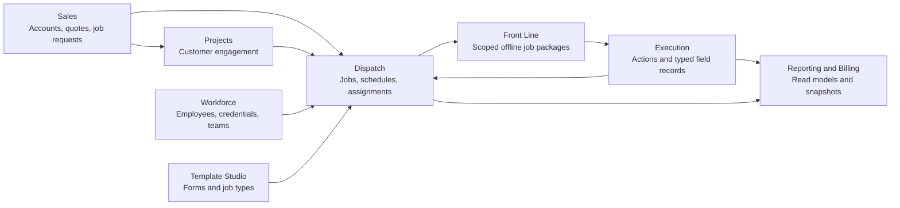
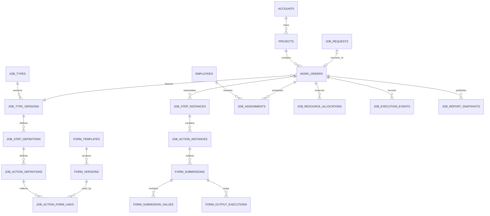
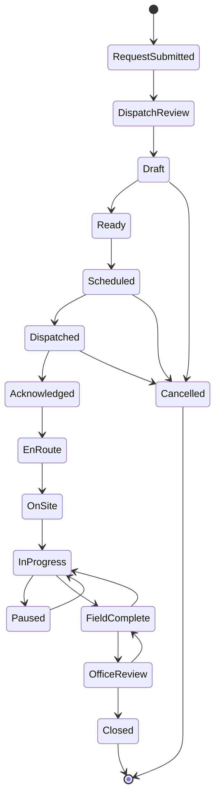
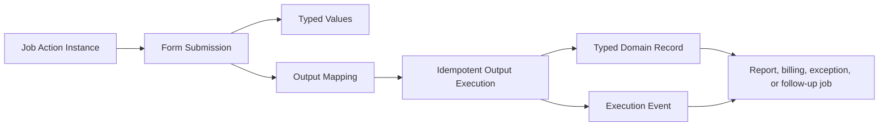

# BioRemedy ERP Operational Architecture

## Purpose

This document defines the system-of-record boundaries for workforce management,
job intake, dispatch, field execution, Front Line synchronization, reporting,
and billing. It is the contract for database migrations `018` through `025`.

The architecture follows three rules:

1. A project is a customer engagement. A job is one dispatchable work packet.
2. Templates are versioned definitions. Jobs contain frozen execution instances.
3. Forms create typed operational records. A submission is never the end of a workflow.

## Application Boundaries

The ERP database and service API are authoritative. Front Line is a separate
deployable application, but it does not own a second business data model. It
stores temporary offline projections, commands, and attachment queues.

## Core Aggregate Relationships

## Domain Ownership

| Domain | Owns | May reference | Must not own |
|---|---|---|---|
| Identity | `system_users`, authorization claims | Employees | Employment history |
| Workforce | Employees, credentials, certifications, skills, teams, crews, availability | Identity, equipment types | Payroll, SSNs, benefits |
| Sales | Customers, contacts, opportunities, quotes, job requests | Projects, job conversion | Field execution |
| Projects | Engagement scope, project chronology, sites, samples | Jobs, customers | Dispatch schedules |
| Template Studio | Form and job type definitions and versions | Skills, credentials, products | Job responses |
| Dispatch | Jobs, location snapshots, schedule segments, assignments, resources, conflicts | Projects, workforce, templates | Form definitions |
| Execution | Step/action instances, submissions, events, typed field records | Jobs, workers, forms | Published templates |
| Front Line | Device registration, job packages, commands, sync cursors, upload state | Assignments and execution APIs | Authoritative ERP records |
| Reporting and Billing | Cost/charge candidates, review state, report snapshots, read models | All typed execution records | Raw mobile drafts |

## Workforce Dictionary

Migration: `018_workforce_identity_and_credentials.sql`

| Table | Purpose | Important relationships |
|---|---|---|
| `employees` | Operational employee or contractor profile | Optional 1:1 `system_users`; many:1 business unit and manager |
| `employment_assignments` | Effective-dated position and reporting history | Many:1 employee, business unit, manager |
| `credential_types` | Driver license, permit, identity, clearance, and similar definitions | 1:many employee credentials |
| `employee_credentials` | Issued credential, expiration, verification, and evidence | Many:1 employee and credential type |
| `certification_types` | Training and competency definitions such as HAZWOPER | 1:many employee certifications |
| `employee_certifications` | Issuance, renewal, verification, and evidence | Many:1 employee and certification type |
| `skills` | Operational capability catalog | Many:many employees through `employee_skills` |
| `employee_skills` | Skill proficiency and verification | Many:1 employee and skill |
| `equipment_qualification_types` | Qualification to operate an equipment class | Optional certification requirement |
| `employee_equipment_qualifications` | Worker qualification status and expiration | Many:1 employee and qualification type |
| `employee_documents` | Workforce-scoped policy, onboarding, qualification, and employment evidence | Employee and file |

`system_users` answers "who can sign in?" `employees` answers "who can be
scheduled and perform work?" An employee can exist without application access.

## Teams, Crews, and Availability Dictionary

Migration: `019_teams_crews_availability.sql`

| Table | Purpose | Important relationships |
|---|---|---|
| `teams` | Durable organization and reporting group | Manager employee and business unit |
| `team_memberships` | Effective-dated employee membership | Many:1 team and employee |
| `crews` | Named dispatchable field group | Supervisor employee and business unit |
| `crew_members` | Effective-dated crew composition | Many:1 crew and employee |
| `work_calendars` | Workweek and timezone policy | Business unit |
| `shift_templates` | Recurring expected shift | Many:1 work calendar |
| `employee_calendar_assignments` | Effective employee calendar | Many:1 employee and calendar |
| `employee_shift_assignments` | Materialized scheduled shift | Employee and optional template |
| `availability_blocks` | Available, unavailable, preferred, restricted, or on-call time | Employee |
| `time_off_requests` | Requested and approved absence | Employee and reviewer |
| `on_call_rotations` | Time-bounded escalation roster | Business unit |
| `on_call_rotation_members` | Ordered workers in a rotation | Rotation and employee |

A team is organizational. A crew is operational. Job assignments are the final
record of who was actually scheduled, even when the assignment originated from
a crew.

## Form Template Dictionary

Migration: `020_form_template_engine.sql`

| Table | Purpose | Important relationships |
|---|---|---|
| `form_templates` | Stable form identity | 1:many versions |
| `form_versions` | Immutable published form contract | Template, publisher |
| `form_sections` | Ordered and optionally repeatable grouping | Version |
| `form_fields` | Typed question, capture, reference, or calculation | Version and section |
| `form_field_options` | Ordered select options | Field |
| `form_field_rules` | Visibility, requirement, validation, and calculation logic | Source and target fields |
| `form_output_mappings` | Converts submissions into records, events, exceptions, or follow-up work | Version |
| `form_version_publication_checks` | Validation evidence required before publish | Version |

Published versions are immutable. Corrections create a new version. Jobs and
submissions always reference `form_versions.id`.

## Job Type Dictionary

Migration: `021_job_type_template_engine.sql`

| Table | Purpose | Important relationships |
|---|---|---|
| `job_types` | Stable service or job type identity | 1:many versions |
| `job_type_versions` | Immutable published dispatch and execution contract | Job type |
| `job_step_definitions` | Ordered phase within a job type | Job type version |
| `job_action_definitions` | Executable instruction, form, timer, sample, material, or approval | Step |
| `job_action_definition_dependencies` | Prerequisite graph between actions | Action to action |
| `job_action_form_links` | Specific form versions required by an action | Action and form version |
| `job_type_required_certifications` | Certification coverage rule | Version and certification type |
| `job_type_required_credentials` | Credential coverage rule | Version and credential type |
| `job_type_required_skills` | Skill and proficiency coverage rule | Version and skill |
| `job_type_required_resources` | Equipment, product, vehicle, or vendor defaults | Version |
| `job_type_publication_checks` | Publish readiness evidence | Version |

Definitions describe future jobs. They are copied into job step and action
instances when a job package is created. Historical jobs do not change when a
template is revised.

### Prototype status: template-driven gating (August 16, 2026)

The running prototype now enforces a simplified subset of
`job_status_transition_rules` and `job_action_definition_dependencies` in
`app.js`, against the JSON-backend `jobSteps`/`jobActions` collections rather
than SQL. `getWorkPlanGate(job)` is the single rule source and is applied inside
`advanceDispatchJob`, so the desktop Job Detail page and the Front Line
simulator are gated identically:

- A task typed `Status transition` (every seeded template has exactly one, at
  stage 1 sequence 1) advances the job to `acknowledged` when completed in the
  field app. Until then the manual `Mark acknowledged` button is disabled.
- `on_site -> in_progress` requires the first stage (`Mobilize` in every seeded
  template) to be complete.
- `in_progress -> field_complete` requires every required stage to be complete.
- Office-side transitions (`draft` through `dispatched`, and `field_complete`
  onward) stay manual and ungated.
- Jobs with no instantiated work plan are not gated at all.

Within a stage, actions unlock positionally: the first non-complete action of an
unlocked stage is the actionable one. Availability is deliberately derived from
position rather than the stored `status` string, so a record whose status
drifted out of sync cannot dead-end the job. Stage/action `status` values are
still written so both surfaces display consistent badges.

The full dependency graph (`job_action_definition_dependencies`) is not
implemented — the prototype assumes simple sequential ordering by `sequence`.

### Prototype status: typed task capture (August 16, 2026)

Task `type` now drives what the field app collects, instead of every type
sharing one notes box. Template tasks carry a per-type `config` object, authored
in the Job Templates editor and frozen onto `jobActions` at job creation:

| Type | Template config | Field capture |
|---|---|---|
| Checklist | `options[]` | Tick boxes built from those options |
| Photo | `minPhotos` | Camera/file input, blocks submit below the minimum |
| Signature | `signerRole` | Canvas signature, stored as a PNG attachment |
| Timer | `anchor` status | Hours auto-computed from `jobStatusEvents`, crew-correctable |
| Material | `suggestedItemIds[]` | Picks `inventoryItems` and **decrements real stock** |
| Sample | matrix/container/analyses defaults | Full sample record with GPS |
| Form, Status transition | none | Notes box / status advance |

Supporting collections: `jobStatusEvents` (one row per dispatch status change —
the Timer's measuring anchor and useful job history in its own right) and
`jobTaskAttachments` (photo and signature files on disk under `data/uploads`).
Submissions carry a typed `payload` object rendered on both the desktop job
detail and the field app.

Notable constraints, all deliberate:

- Material consumption is a dedicated endpoint (`POST /api/job-actions/:id/consume`)
  rather than a generic record write, because it must validate every line before
  mutating anything, reject over-draw, and refuse a second submission for the
  same task. It is the only path in the app that draws `inventoryItems.onHand`
  down.
- `inventoryItems` is now readable by `dispatch` roles as well as `inventory`
  ones, so a field lead can see stock. Write access to purchasing and equipment
  is unchanged.
- The attachment inline-view route is **not** role-gated: it is loaded by
  ``, and browsers cannot attach the `X-CRM-Role` header to an image
  request. Access rests on attachment ids being opaque. Revisit when real auth
  replaces the header-based role shim.
- A field sample links to the dispatch job (`dispatchJobId`), the originating
  task (`actionId`), and the operations project (`jobId`, resolved from
  `dispatchJob.projectId`), so it surfaces in the project and account sample
  lists without the tech linking anything by hand.

## Job Intake and Dispatch Dictionary

Migration: `022_jobs_dispatch_assignments.sql`

| Table | Purpose | Important relationships |
|---|---|---|
| `job_requests` | Sales request to dispatch with caller, PO, location, scope, labor, equipment, vendor, and pricing notes | Account, contact, project, quote, site |
| `job_request_documents` | Customer packet, quote, PO, site document, and intake evidence | Request and file |
| `job_status_definitions` | Ordered job lifecycle catalog | Transition rules |
| `job_status_transition_rules` | Permitted actor-scoped state transitions | From and to status |
| `work_orders` | First-class dispatchable job | Project, request, account, site, frozen job type version |
| `job_contacts` | Role-specific contact snapshots | Job and optional master contact |
| `job_locations` | Immutable address, coordinates, access, and timezone snapshot | Job and optional master site |
| `job_schedule_segments` | Planned and actual travel, work, break, and standby intervals | Job and location |
| `job_assignments` | Worker or crew assignment, acknowledgment, and eligibility audit | Job, employee, crew, segment |
| `job_resource_allocations` | Planned equipment, vehicle, material, vendor, or facility | Job and segment |
| `job_schedule_conflicts` | Detected overlap, availability, credential, skill, resource, or hours issue | Job, assignment, allocation |
| `dispatch_events` | Auditable dispatch and lifecycle changes | Job and optional assignment |
| `job_documents` | Job-scoped documents and visibility rules | Job and file |

`work_orders.status` is the job lifecycle. `job_assignments.assignment_status`
is the worker's lifecycle. `dispatch_status` is delivery/coordination state.
These must not be collapsed into one field.

**Planning note for future subcontractor linkage:** `job_resource_allocations`
currently links a vendor to a job with `resource_type = 'vendor'` and
`vendor_account_id UUID REFERENCES accounts(id)` (line 451 above). Once the
account-layer vendor/subcontractor tables exist
(`027_vendor_subcontractor_management.sql`: `vendor_profiles`,
`subcontractor_assignments`), job-level relationships should link to a
`subcontractor_assignments` row instead of connecting straight to an account
or vendor profile. A `subcontractor_assignments` row carries job-specific
terms (scope, rate, start/end dates) that don't belong on the vendor's
general standing record, and keeps assignment history intact even if the
vendor's profile changes later. This is a future migration, not done yet --
`job_resource_allocations.vendor_account_id` still points straight at
`accounts` today.

## Job Status Machine

Transition rules are data, but transitions are authorized and validated by the
service layer. Front Line submits transition commands rather than updating job
rows directly.

## Execution Dictionary

Migration: `023_job_execution_events.sql`

| Table | Purpose | Important relationships |
|---|---|---|
| `job_step_instances` | Frozen step and current execution state | Job and optional definition |
| `job_action_instances` | Frozen field action and state | Job, step, optional definition |
| `job_action_instance_dependencies` | Runtime prerequisite state | Action to action |
| `form_submissions` | Versioned form response envelope | Job, action, assignment, form version |
| `form_submission_values` | Typed answer values and references | Submission and optional field |
| `form_output_executions` | Idempotent execution of each configured output mapping | Submission and output mapping |
| `job_execution_events` | Append-only chronological event stream | Job, action, submission, assignment |
| `job_time_entries` | Travel, work, break, standby, and other time | Job, worker, assignment |
| `job_mileage_entries` | Beginning/ending odometer and calculated distance | Job, worker, vehicle/equipment |
| `job_material_usage` | Typed material consumption | Job, action, product, form |
| `job_equipment_usage` | Typed equipment usage and condition | Job, action, equipment, form |
| `job_media` | Photos, video, audio, and scan metadata | Job, action, form, file |
| `job_signatures` | Authorization, completion, worker, supervisor, and waste attestations | Job, form, file |
| `job_exceptions` | Safety, scope, data, or operational exception | Job, action, form |
| `job_waste_containers` | Generated and tracked waste units | Job, action, form |
| `job_waste_shipments` | Transport, manifest, receipt, and disposal status | Job and accounts |
| `job_waste_shipment_containers` | Shipment/container relationship | Many:many |
| `job_receipts` | Vendor receipt and billable status | Job, worker, file |

Sampling remains in `sampling_sessions` and `project_samples`; both receive job
and action references so a sample remains visible at project and job levels.

## Output Mapping Lifecycle

Examples of typed outputs are a sample, material usage, equipment usage, time
entry, waste container, signature, receipt, or exception. JSON payloads carry
supporting metadata but do not replace these durable records.

## Front Line Dictionary

Migration: `024_frontline_devices_and_sync.sql`

| Table | Purpose | Important relationships |
|---|---|---|
| `frontline_devices` | Device identity, capability, status, and revocation | Registering user |
| `frontline_device_assignments` | Effective device-to-worker ownership | Device and employee |
| `frontline_device_sessions` | Hashed session identity and expiration | Device, employee, user |
| `frontline_job_packages` | Versioned offline projection for one job | Job |
| `frontline_job_package_recipients` | Worker/device delivery and acknowledgment state | Package, assignment, employee, device |
| `frontline_commands` | Idempotent mobile write request | Device, employee, job, assignment |
| `frontline_attachment_uploads` | Resumable upload state and final file link | Device, command, job |
| `frontline_sync_changes` | Ordered server change feed | Optional worker and job audience |
| `frontline_sync_cursors` | Per-device incremental pull/push checkpoint | Device and employee |
| `frontline_sync_conflicts` | Version, transition, assignment, authorization, and deletion conflicts | Command and device |
| `frontline_push_subscriptions` | Encrypted push endpoint configuration | Device and employee |

Front Line endpoints should be shaped around:

- `GET /frontline/bootstrap`
- `GET /frontline/assignments`
- `GET /frontline/jobs/{jobId}/package`
- `POST /frontline/commands`
- `POST /frontline/uploads`
- `GET /frontline/sync?cursor={cursor}`

Packages contain only the assigned worker's jobs, required forms, permitted
customer data, resource references, and supporting documents. They must not
contain unrelated customers or jobs.

## Conflict and Offline Rules

1. Every mobile command carries a device-scoped client command ID and idempotency key.
2. Mutable aggregates carry a `row_version`.
3. Append-only observations can merge when their idempotency key is new.
4. Lifecycle transitions are revalidated by the server.
5. Assignment revocation and job cancellation override offline edits that would reopen work.
6. Attachments upload separately and are linked only after hash verification.
7. Rejected commands remain visible to the worker with a resolvable reason.
8. Device revocation stops new package and change delivery immediately.

## Reporting and Billing Dictionary

Migration: `025_job_reporting_and_billing_views.sql`

| Table or view | Purpose |
|---|---|
| `job_cost_entries` | Normalized internal cost candidates from labor, material, equipment, vendors, travel, disposal, and receipts |
| `job_charge_entries` | Billable candidates tied to rates and eventual sales or invoice lines |
| `job_billing_reviews` | Office review queue and totals snapshot |
| `job_report_snapshots` | Immutable generated report version and source hash |
| `job_report_section_snapshots` | Frozen ordered report section content |
| `job_detail_view` | Complete job header, location, progress, schedule, worker, resource, and exception projection |
| `job_dispatch_readiness_view` | Ready, warning, or blocked dispatch projection with reasons |
| `frontline_assignment_view` | Scoped mobile assignment and package projection |
| `job_billing_summary_view` | Cost, approved charges, invoiced amount, and margin projection |
| `job_report_timeline_view` | Chronological execution, form, media, and sample report source |

Generated PDFs are artifacts. The typed records and approved report snapshot are
the authoritative source. A report can be regenerated from its source manifest.

## Workspace Panels

| Workspace | Panels |
|---|---|
| Sales | Accounts, contacts, opportunities, quotes, job requests |
| Dispatch | Intake queue, unassigned jobs, dispatch board, calendar, resources, conflicts |
| Operations | Projects, active jobs, map, samples, waste, reports |
| Workforce | Directory, worker detail, credentials, teams, crews, availability, training, schedule, devices |
| Template Studio | Form templates, job types, publish review, retired versions |
| Inventory | Equipment, vehicles, products, stock, purchase orders |
| Finance | Job billing review, costs, charges, invoices, margin |
| Front Line | My Day, jobs, actions, forms, capture, time, resources, sync |

The Office Manager dashboard is a role-oriented landing page. It links to
Dispatch, Workforce, Operations, and Finance records rather than maintaining
simplified duplicate data.

## Security Boundary

- Identity and API claims determine access; UI visibility is not authorization.
- Dispatcher overrides require a reason and an audit event.
- Credential evidence and employee documents have workforce-specific permissions.
- Front Line receives least-privilege job packages and never direct SQL access.
- Customer payment cards are tokenized by a payment provider and are never stored
  in these ERP tables.
- Payroll, SSNs, benefits, and detailed medical information belong in a separate
  restricted HR/payroll system or future bounded context.

## Migration Order

1. `018_workforce_identity_and_credentials.sql`
2. `019_teams_crews_availability.sql`
3. `020_form_template_engine.sql`
4. `021_job_type_template_engine.sql`
5. `022_jobs_dispatch_assignments.sql`
6. `023_job_execution_events.sql`
7. `024_frontline_devices_and_sync.sql`
8. `025_job_reporting_and_billing_views.sql`

Views and application panels should be implemented only after these tables and
service contracts are accepted. The first UI slices should be Workforce
Directory, Dispatch Intake, Job Detail, and Template Studio because they test
the boundaries with the least mobile-specific complexity.
